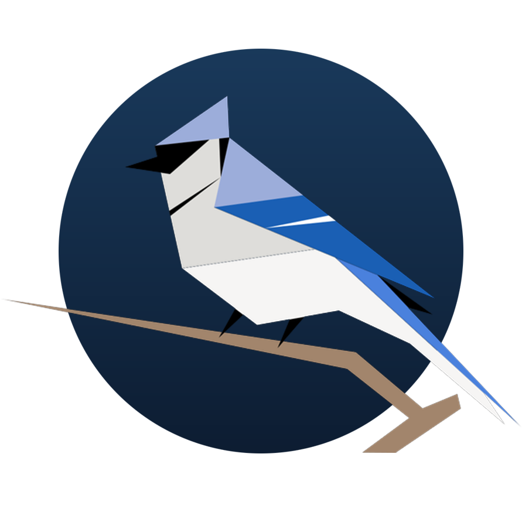

# BirdNET-STM32

<p align="center">
  <br>
  <a href="LICENSE.md"></a>
  <a href="LICENSE-MODELS.md"></a>
  <a href="https://www.python.org/downloads/"></a>
  <a href="https://birdnet-team.github.io/birdnet-stm32"></a>
  <a href="https://github.com/birdnet-team/birdnet-stm32/releases/tag/v1.0.0"></a>
</p>

Bird sound classification for edge deployment on the [STM32N6570-DK](https://www.st.com/en/evaluation-tools/stm32n6570-dk.html) development board with neural processing unit (NPU).


A compact DS-CNN trained on raw waveforms or spectral features, quantized to
INT8 with post-training quantization or quantization-aware fine-tuning, and
deployed using ST's X-CUBE-AI toolchain. The standalone firmware supports raw
waveform, hybrid STFT, and precomputed-mel deployment paths. In a verified
24 kHz, 2.5-second raw configuration, inference takes **12–13 ms on the NPU**
and about **84 ms total** including SD-card input; exact timing depends on the
model and SD card.

## Quick start

```bash
# Install
git clone https://github.com/birdnet-team/birdnet-stm32.git
cd birdnet-stm32
python3.12 -m venv .venv && source .venv/bin/activate
pip install -e ".[dev]"

# Train
python -m birdnet_stm32 train \
  --data_path_train data/train \
  --audio_frontend hybrid --mag_scale pwl

# Convert to quantized TFLite
python -m birdnet_stm32 convert \
  --checkpoint_path checkpoints/best_model.keras \
  --model_config checkpoints/best_model_model_config.json \
  --data_path_train data/train

# Evaluate
python -m birdnet_stm32 evaluate \
  --model_path checkpoints/best_model_quantized.tflite \
  --model_config checkpoints/best_model_model_config.json \
  --data_path_test data/test --pooling lme

# Deploy to STM32N6570-DK (requires config.json; see config.example.json)
python -m birdnet_stm32 deploy

# On-board integration test (requires SD card with test audio)
python -m birdnet_stm32 board-test
```

### SD card preparation for board-test

The `board-test` command runs inference entirely on the STM32N6570-DK. It reads
WAV files from the SD card, applies the model-specific preprocessing on the
board (peak normalization for `raw`, STFT for `hybrid`, or STFT + mel for
`librosa`), and runs the model on the NPU. **WAV files must match the model's
sample rate**, recorded in `_model_config.json`; mismatches are skipped.

Prepare the SD card as follows:

1. Format as FAT32.
2. Create an `audio/` directory at the root.
3. Copy `.wav` files (mono or stereo, 16-bit PCM) into `audio/`.
   Each file should be at least as long as the model's chunk duration (default 3 s).
4. Insert the SD card into the STM32N6570-DK board slot.

See the [full documentation](https://birdnet-team.github.io/birdnet-stm32) for detailed guides on [dataset preparation](https://birdnet-team.github.io/birdnet-stm32/dataset/), [training](https://birdnet-team.github.io/birdnet-stm32/training/), [conversion](https://birdnet-team.github.io/birdnet-stm32/conversion/), [evaluation](https://birdnet-team.github.io/birdnet-stm32/evaluation/), and [deployment](https://birdnet-team.github.io/birdnet-stm32/deployment/).

## Pre-trained models

Trained and converted models are published as release assets — grab a bundle from
the [latest release](https://github.com/birdnet-team/birdnet-stm32/releases/latest).

### What's in a bundle

Every file shares one basename, `BirdNET_Tiny_N6_<REGION>_<SPECIES>_V<VERSION>`:

| File | Use it for |
|---|---|
| `<basename>_INT8.tflite` | Deploying to the STM32N6 — this is the model you flash |
| `<basename>_model_config.json` | Input, frontend, and class contract; drives firmware config |
| `<basename>_labels.txt` | Ordered output labels |
| `<basename>_FP32.keras` | Host inference, fine-tuning, re-conversion |
| `<basename>_original_FP32.keras` | Pre-QAT checkpoint, for retraining from an untouched state |
| `<basename>_FP32.onnx` | Host and interchange inference |
| `<basename>_INT8_stedgeai_report.txt` | Memory footprint and NPU operator coverage |
| `<basename>_model_card.md` | Contract, provenance, measured accuracy, and on-board timing |

The TFLite model, config, and labels are a single contract — keep them together
and never mix files across bundles. Models are licensed under the
[Apache License 2.0](LICENSE-MODELS.md); the bundle also carries the
[acceptable use policy](ACCEPTABLE_USE.md).

### Running a bundle on the board

Everything the firmware needs is in the bundle — no extra downloads.

1. Install the toolchain (X-CUBE-AI, STM32CubeProgrammer/IDE, ARM GNU) and copy
   `config.example.json` to `config.json`, filling in your local tool paths.
2. Prepare an SD card with test audio as described above, matching the sample
   rate in `_model_config.json`.
3. Compile, flash, and run on the NPU:

   ```bash
   BUNDLE=~/Downloads/BirdNET_Tiny_N6_USNE_30_V1.0

   python -m birdnet_stm32 board-test \
     --model_path    "$BUNDLE"/*_INT8.tflite \
     --model_config  "$BUNDLE"/*_model_config.json \
     --labels        "$BUNDLE"/*_labels.txt
   ```

The command generates the N6 binary, flashes the board over serial, runs
inference on every WAV on the SD card, and streams the top predictions back over
UART. See the [deployment guide](https://birdnet-team.github.io/birdnet-stm32/deployment/)
for toolchain setup and troubleshooting.

## Features

### Training

- **Audio frontends**: `hybrid` (linear STFT + learned mel mixer), `raw` (waveform → learned Gabor quadrature filterbank), `librosa` (precomputed mel), `mfcc`, and `log_mel`. The standalone firmware supports `raw`, `hybrid`, and `librosa`.
- **Magnitude scaling**: `pwl` (piecewise-linear, quantization-friendly), `pcen`, `db`, `none`
- **Model**: DS-CNN with configurable width (`--alpha`) and depth (`--depth_multiplier`), SE attention and inverted residuals (on by default; disable with `--no_se`, `--no_inverted_residual`), and optional attention pooling (`--use_attention_pooling`)
- **Augmentation**: Dirichlet multi-source mixup with multi-label union targets for overlapping vocalizations, SpecAugment (on by default), smart crop for long recordings
- **Optimization**: linear warmup into cosine LR decay, Adam/SGD/AdamW, gradient clipping (on by default), mixed precision (FP16). Standard training checkpoints track validation ROC-AUC; QAT checkpoints track lower-tail teacher/student parity and retain ROC-AUC for the task-accuracy gate
- **QAT**: native Keras 3 quantization-aware fine-tuning via `--qat` — uses the converter's exact calibration manifest to simulate the INT8 input, per-channel kernels, fused activation boundaries, and otherwise-opaque raw-frontend internals; frozen-teacher KL plus mean and configurable worst-sample cosine consistency protect probability calibration and lower-tail parity while a clean deployment model is checkpointed
- **Linear probing**: `--linear_probe` freezes a pretrained backbone and trains only the classifier head
- **Hyperparameter tuning**: Optuna search via `--tune --n_trials N`

### Conversion

- **Post-training quantization**: INT8 internals, float32 I/O, per-channel (default) or per-tensor
- **Dynamic range quantization**: `--quantization dynamic` — no calibration data needed
- **Validation**: mean and tail cosine similarity, MSE, MAE, and Pearson r on a deterministic held-out calibration split
- **Atomic quality gate**: failed conversions never promote a release-looking `.tflite`
- **ONNX export**: `--export_onnx` uses the Keras 3 exporter, ONNX checker, and ONNX Runtime parity gate (requires `tf2onnx`, `onnx`, and `onnxruntime`)

### Evaluation

- **Pooling**: avg, max, LME (log-mean-exponential)
- **Metrics**: ROC-AUC, cmAP, mAP, precision, recall, F1
- **Species AP report**: per-species AP with bootstrap 95% CI (`--species_report`)
- **DET curve**: detection error tradeoff (`--det_curve`, `--save_det_plot`)
- **Latency measurement**: per-chunk inference timing (`--benchmark_latency`)
- **Benchmark JSON**: structured report for experiment tracking (`--benchmark`)
- **HTML report**: self-contained evaluation report (`--report_html`)

### Deployment

- **X-CUBE-AI / stedgeai**: generate → flash → validate pipeline
- **Board test**: standalone on-device inference (`board-test`) — reads WAV from SD, performs frontend-specific preprocessing, runs the NPU, and captures results over UART


## License

- **Source code**: [MIT License](LICENSE.md)
- **Model artifacts** (checkpoints, `.tflite`/`.onnx` exports, labels, model config): [Apache License 2.0](LICENSE-MODELS.md)
- **Third-party firmware sources**: STMicroelectronics (BSD-3-Clause) and ChaN's FatFs retain their original licenses — see [firmware/THIRD_PARTY_LICENSES.md](firmware/THIRD_PARTY_LICENSES.md).
- **STM tools and scripts**: see respective documentation for license details.

## Citation

```bibtex
@article{kahl2025birdnetstm32,
  title={A quantization-friendly audio classification pipeline for embedded bioacoustics on microcontroller NPUs},
  author={Kahl, Stefan and Marshall, Isabella and Chaopricha, Patrick T. and Aceto, Jordan and Klinck, Holger},
  year={2025}
}
```

## Contributing

See [CONTRIBUTING.md](CONTRIBUTING.md) for guidelines. AI-assisted contributions are welcome — keep PRs focused and review every line.

## Acceptable Use

BirdNET is built to support biodiversity research and conservation. See
[ACCEPTABLE_USE.md](ACCEPTABLE_USE.md) for how we expect the code and models to be used,
including uses we consider unacceptable and guidance on branding derivative work.

## Funding

Our work in the Cornell K. Lisa Yang Center for Conservation Bioacoustics is made possible by the generosity of K. Lisa Yang to advance innovative conservation technologies to inspire and inform the conservation of wildlife and habitats.

The development of BirdNET is supported by the German Federal Ministry of Research, Technology and Space (FKZ 01|S22072), the German Federal Ministry for the Environment, Climate Action, Nature Conservation and Nuclear Safety (FKZ 67KI31040E), the German Federal Ministry of Economic Affairs and Energy (FKZ 16KN095550), the Deutsche Bundesstiftung Umwelt (project 39263/01) and the European Social Fund.

## Partners

BirdNET is a joint effort of partners from academia and industry.
Without these partnerships, this project would not have been possible.
Thank you!


