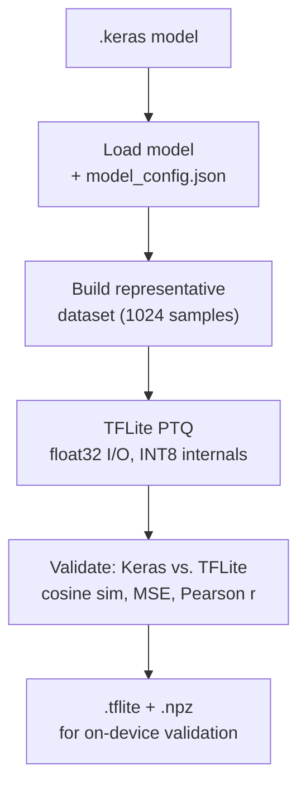

# Model Conversion

Convert a trained Keras model to a quantized TFLite model using post-training
quantization (PTQ) with INT8 internals and float32 I/O.

## Basic usage

```bash
python convert.py \
  --checkpoint_path checkpoints/my_model.keras \
  --model_config checkpoints/my_model_model_config.json \
  --data_path_train data/train
```

This produces:

- `my_model_quantized.tflite` — quantized TFLite model
- `my_model_quantized_validation_data.npz` — validation inputs/outputs for
  on-device comparison

## How it works


6. Saves a small `.npz` file for later on-device validation with
   `stedgeai validate`.

## Validation metrics

After conversion, the script reports:

| Metric | Target | Description |
|---|---|---|
| Cosine similarity | > 0.95 | Directional agreement of output vectors |
| MSE | Low | Mean squared error |
| MAE | Low | Mean absolute error |
| Pearson r | > 0.95 | Linear correlation |

!!! warning "Cosine similarity < 0.95"
    If cosine similarity drops below 0.95, the quantized model may behave
    significantly differently from the float model. Common causes:

    - Overly diverse representative dataset widens INT8 ranges.
    - Using `db` magnitude scaling (poor quantization behavior).
    - Very wide channel counts without proper alignment.

## Arguments

| Argument | Default | Description |
|---|---|---|
| `--checkpoint_path` | *(required)* | Path to trained `.keras` model |
| `--model_config` | *(inferred)* | Path to `_model_config.json` |
| `--output_path` | *(inferred)* | Output `.tflite` path |
| `--data_path_train` | None | Training data for representative dataset |
| `--num_samples` | 1024 | Number of representative samples |
| `--validate_samples` | 256 | Samples for Keras vs. TFLite validation |
| `--min_cosine_sim` | 0.95 | Fail conversion if cosine similarity is below this |

## Quantization details

- **Scheme**: full integer quantization (INT8 weights + INT8 activations)
- **I/O**: float32 — audio inputs are continuous-valued and lose meaningful
  precision at INT8
- **Calibration**: representative dataset drawn from training data, center-
  cropped to chunk duration
- **Target hardware**: STM32N6 NPU (requires channel counts in multiples of 8)

!!! note "No INT8 I/O"
    Audio spectrograms are continuous-valued signals. Quantizing model inputs
    to INT8 would destroy meaningful precision. The pipeline enforces float32
    I/O with INT8 internals only.
