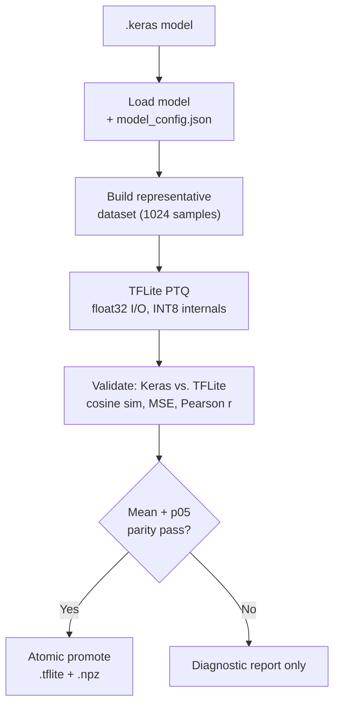

# Model Conversion

Convert a trained Keras model to a quantized TFLite model using post-training
quantization (PTQ) with INT8 internals and float32 I/O.

## Basic usage

```bash
python -m birdnet_stm32 convert \
  --checkpoint_path checkpoints/my_model.keras \
  --model_config checkpoints/my_model_model_config.json \
  --data_path_train data/train
```

This produces:

- `my_model_quantized.tflite` — quantized TFLite model
- `my_model_quantized_labels.txt` — ordered output labels
- `my_model_quantized_validation_data.npz` — validation inputs for
  on-device comparison

## How it works


```mermaid
flowchart TD
    A[".keras model"] --> B["Load model\n+ model_config.json"]
    B --> C["Build representative\ndataset (1024 samples)"]
    C --> D["TFLite PTQ\nfloat32 I/O, INT8 internals"]
    D --> E["Validate: Keras vs. TFLite\ncosine sim, MSE, Pearson r"]
    E --> F{"Mean + p05\nparity pass?"}
    F -->|Yes| G["Atomic promote\n.tflite + .npz"]
    F -->|No| H["Diagnostic report only"]
```

## Validation metrics

After conversion, the script reports:

| Metric | Target | Description |
|---|---|---|
| Mean cosine similarity | ≥ 0.95 | Average directional agreement of output vectors |
| Fifth-percentile cosine | ≥ 0.90 | Tail agreement; prevents the mean hiding severe failures |
| MSE | Low | Mean squared error |
| MAE | Low | Mean absolute error |
| Pearson r | > 0.95 | Linear correlation |

!!! warning "Cosine similarity < 0.95"
    The command fails if either cosine gate is missed. Conversion occurs in a
    temporary file, and the final `.tflite` is promoted only after validation.
    Common causes include:

    - Overly diverse representative dataset widens INT8 ranges.
    - Using `db` magnitude scaling (poor quantization behavior).
    - Very wide channel counts without proper alignment.

    First inspect calibration coverage and repeat parity on held-out examples.
    If representative calibration cannot pass reliably, use QAT and rerun the
    complete conversion, evaluation, STM32N6 analysis, and board checks.

## Arguments

| Argument | Default | Description |
|---|---|---|
| `--checkpoint_path` | *(required)* | Path to trained `.keras` model |
| `--model_config` | *(inferred)* | Path to `_model_config.json` |
| `--output_path` | *(inferred)* | Output `.tflite` path |
| `--data_path_train` | None | Training data for representative dataset |
| `--num_samples` | 1024 | Number of representative samples |
| `--validate_samples` | 256 | Samples for Keras vs. TFLite validation |
| `--min_cosine_sim` | 0.95 | Fail conversion if cosine similarity is below this |
| `--min_cosine_p05` | 0.90 | Fail conversion if fifth-percentile cosine is below this |
| `--quantization` | `ptq` | `ptq` (full INT8 with calibration) or `dynamic` (dynamic range, no calibration data) |
| `--per_tensor` | off | Use per-tensor quantization instead of per-channel |
| `--batch_validate` | 0 | Run validation N times with different seeds, report worst-case |
| `--export_onnx` | off | Export and validate ONNX (requires `tf2onnx`, `onnx`, and `onnxruntime`) |
| `--report_json` | None | Save structured JSON conversion report |

## Quantization details

- **Scheme**: full integer quantization (INT8 weights + INT8 activations)
- **I/O**: float32 — audio inputs are continuous-valued and lose meaningful
  precision at INT8
- **Calibration**: deterministic, exactly sized, class-stratified training
  sample including quiet and nuisance recordings; validation paths are
  stratified and disjoint
- **Provenance**: the report records counts, per-class coverage, and SHA-256
  identities for both path manifests
- **Target hardware**: STM32N6 NPU (requires channel counts in multiples of 8)
- **Per-channel** (default): quantizes each output channel separately — better accuracy
- **Per-tensor**: single scale per tensor — use only if per-channel causes N6 issues
- **Dynamic range**: INT8 weights, runtime float activations — no calibration data needed, less compression

When `--export_onnx` is requested, export uses the native Keras 3 ONNX path and
a temporary sibling file. The ONNX checker runs with full validation, then 16
held-out samples must pass ONNX Runtime parity (`cosine_min >= 0.9999` and
`max_abs_error <= 1e-4`) before the final `.onnx` is promoted. Install the
required tools with `pip install 'birdnet-stm32[release]'`.

!!! tip "Quantization modes"
    Use `--quantization ptq` (default) for best on-device performance.
    Use `--quantization dynamic` when no training data is available.
    Use `--per_tensor` only if stedgeai rejects a per-channel model.

!!! note "No INT8 I/O"
    Audio spectrograms are continuous-valued signals. Quantizing model inputs
    to INT8 would destroy meaningful precision. The pipeline enforces float32
    I/O with INT8 internals only.

## Release names

Experiment outputs may keep descriptive internal names. Public model families
use `BirdNET_Tiny_N6_<REGION>_<SPECIES_COUNT>_V<MAJOR.MINOR>`, then append an
uppercase `_FP32`, `_FP16`, or `_INT8` precision token to model artifacts. The
species count excludes nuisance/background outputs. See the
[release process](dev/release-process.md) for required sidecars and validation
gates.
