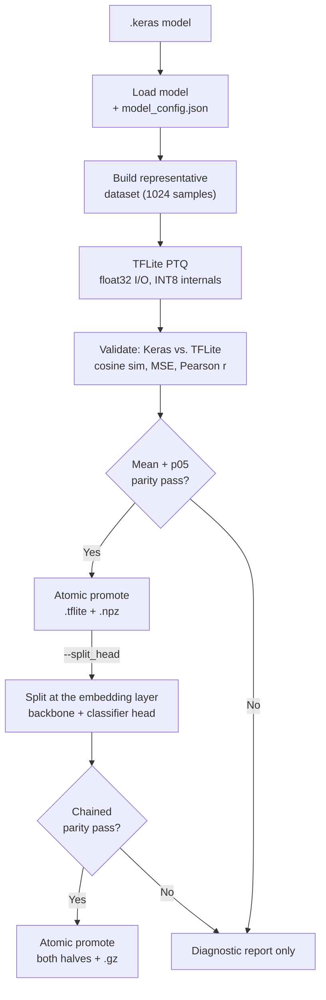
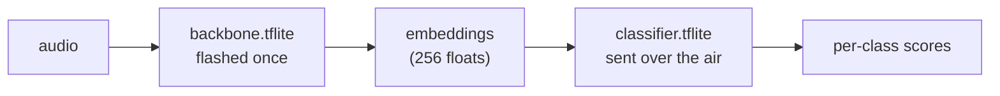

# Model Conversion

Convert a trained Keras model to a quantized TFLite model using post-training
quantization (PTQ) with INT8 internals and float32 I/O.

## Basic usage

```bash
python -m birdnet_stm32 convert \
  --checkpoint_path checkpoints/my_model.keras \
  --model_config checkpoints/my_model_model_config.json \
  --data_path_train data/train
```

This produces:

- `my_model_quantized.tflite` — quantized TFLite model
- `my_model_quantized_labels.txt` — ordered output labels
- `my_model_quantized_validation_data.npz` — validation inputs for
  on-device comparison
Passing `--split_head` adds the
[backbone/classifier split](#backbone-and-classifier-split) artifacts:

- `my_model_quantized_backbone.tflite` (+ `.gz`) — audio → embeddings
- `my_model_quantized_classifier.tflite` (+ `.gz`) — embeddings → scores
- `my_model_quantized_classifier_labels.txt` — the head's own label list

## How it works


```mermaid
flowchart TD
    A[".keras model"] --> B["Load model\n+ model_config.json"]
    B --> C["Build representative\ndataset (1024 samples)"]
    C --> D["TFLite PTQ\nfloat32 I/O, INT8 internals"]
    D --> E["Validate: Keras vs. TFLite\ncosine sim, MSE, Pearson r"]
    E --> F{"Mean + p05\nparity pass?"}
    F -->|Yes| G["Atomic promote\n.tflite + .npz"]
    F -->|No| H["Diagnostic report only"]
    G -->|"--split_head"| I["Split at the embedding layer\nbackbone + classifier head"]
    I --> J{"Chained\nparity pass?"}
    J -->|Yes| K["Atomic promote\nboth halves + .gz"]
    J -->|No| H
```

## Backbone and classifier split

With `--split_head`, conversion also emits the model as two artifacts: a
**backbone** that maps audio to an embedding vector, and a **classifier head**
that maps that embedding to per-class probabilities.

The reason is the update path. The backbone is generic feature extraction and
is flashed once. The head is the only part that changes when the species list
changes — and on a remote deployment it has to arrive over a narrowband
satellite link, where the whole model is far too large to send. Shipping the
head alone turns a ~400 kB update into a few kB.


```mermaid
flowchart LR
    A["audio"] --> B["backbone.tflite
flashed once"]
    B --> C["embeddings
(256 floats)"]
    C --> D["classifier.tflite
sent over the air"]
    D --> E["per-class scores"]
```

### Where the split happens

At the pooling layer that produces the embedding vector (`gap`, or `attn_pool`
with `--use_attention_pooling`). Everything after it — dropout, then the
classifier `Dense` — is rebuilt onto a clean `embeddings` input as a standalone
model with its own copy of the weights. The backbone keeps the audio frontend
and the whole convolutional body.

### How each half is quantized

The backbone is calibrated on the same representative audio as the whole model.
The head is then calibrated on the embeddings the **quantized** backbone
produces for that audio — not on float embeddings, which is not what the board
will feed it.

The two extra conversions roughly double the wall-clock cost of `convert`:
the representative dataset is decoded again for the backbone, and once more to
produce the head's calibration embeddings. That cost is why the split is
opt-in rather than automatic.

### Gates

Three parity measurements are reported, and the third is a hard gate:

| Measurement | Compared against | Gated |
|---|---|---|
| Whole model | Keras vs. TFLite | Yes — `--min_cosine_sim`, `--min_cosine_p05` |
| Backbone | Keras embeddings vs. TFLite embeddings | Reported |
| **Chained** | Keras whole model vs. TFLite backbone → TFLite head | **Yes — same thresholds** |

Both halves are staged in temporary files and promoted together only after the
chained gate passes, so a failed split never leaves a half-valid pair behind.

### Updating the head against a flashed backbone

Once a backbone is on a device it must not move. `--backbone_path` converts only
a new head, calibrating it on embeddings that exact `.tflite` emits:

```bash
python -m birdnet_stm32 convert \
  --checkpoint_path checkpoints/my_model_probe.keras \
  --model_config checkpoints/my_model_model_config.json \
  --data_path_train data/new_classes/train \
  --output_path checkpoints/new_head.tflite \
  --backbone_path release/MyModel_INT8_backbone.tflite
```

The backbone is **not** reconverted and not re-emitted. Reconverting it would
recalibrate its activation ranges against whatever data the new classes arrived
with, producing a backbone that no deployed device has.

Two artifacts come out. `new_head_classifier.tflite` (plus `.gz` and its own
labels) is the over-the-air payload. `new_head.tflite` is the monolithic
backbone-plus-head graph, converted alongside so the board can be tested without
changing firmware that runs a single network.

#### Backbone identity

Whenever `--split_head` writes a backbone it also writes
`<backbone>.tflite.fingerprint.json`, a SHA-256 over the backbone's float
weights in graph order. A head-only conversion recomputes that fingerprint from
its own checkpoint and refuses to proceed on a mismatch:

```
RuntimeError: Backbone mismatch: probe.keras carries backbone a3e37e27... but
release/MyModel_INT8_backbone.tflite was built from 121c0428.... A head
calibrated against a different backbone will not work on a device flashed with
this one. Was the backbone left frozen during fine-tuning?
```

That is the check for the mistake this workflow invites: fine-tuning that
quietly unfreezes the backbone produces a head which scores well in testing and
is useless on the device. `--allow_backbone_mismatch` overrides it for
diagnostics and marks the conversion report accordingly.

The chained gate still applies, measured against the flashed backbone rather
than a freshly built one.

### Running a split model

Evaluation takes the head as a second argument and chains the two:

```bash
python -m birdnet_stm32 evaluate \
  --model_path checkpoints/my_model_quantized_backbone.tflite \
  --classifier_path checkpoints/my_model_quantized_classifier.tflite \
  --model_config checkpoints/my_model_model_config.json \
  --data_path_test data/test
```

### Making the head small

The head is a single `Dense` of `embedding_dim × num_classes`, so its weight
count is exactly that product — a 256-d embedding driving 100 outputs is 25,600
INT8 weights. On top sits roughly 2 kB of TFLite flatbuffer overhead that does
not shrink with the model, which dominates for small class counts.

`--prune` targets the head by default and `--prune_head_sparsity` compresses it
harder than the backbone, which is what makes the gzipped head small — zeroed
INT8 weights compress, random ones do not. See
[Pruning](training.md#pruning).

```bash
# Prune the backbone to 50% and the shipped head to 75%
python -m birdnet_stm32 train --data_path_train data/train \
  --data_path_val data/validation --classes_file data/labels.txt --prune \
  --checkpoint_path checkpoints/model.keras \
  --prune_final_sparsity 0.5 --prune_head_sparsity 0.75 \
  --epochs 12 --learning_rate 0.0002
```

Measured on a 10-species, 256-d model — same architecture, same conversion
settings, only the head's sparsity differs:

| Classifier head | INT8 sparsity | `.tflite` | gzipped |
|---|---|---|---|
| Dense | 0.4% | 4,704 B | 3,631 B |
| `--prune_head_sparsity 0.75` | 75.0% | 4,704 B | **2,067 B** |

Pruning does not change the `.tflite` itself — TFLite stores INT8 weights
densely — but it cuts the transmitted payload by 43%.

Note the floor: 2,560 INT8 weights in a 4,704 B file means roughly 2 kB is
flatbuffer scaffolding that no amount of sparsity removes. The wider the
embedding and the more species, the smaller that fixed cost is as a fraction.

The conversion report records `size_bytes`, `gzip_bytes`, and `int8_sparsity`
for both halves under `split`, so an update budget can be checked directly.

!!! warning "Firmware runs one network today"
    The firmware and `stedgeai` deployment path compile a single network. Using
    the split pair on-device requires running two networks back to back and
    passing the embedding buffer between them, which is not implemented yet.
    The split artifacts are produced, validated, and measured; wiring them into
    the firmware is separate work.

## Validation metrics

After conversion, the script reports:

| Metric | Target | Description |
|---|---|---|
| Mean cosine similarity | ≥ 0.95 | Average directional agreement of output vectors |
| Fifth-percentile cosine | ≥ 0.90 | Tail agreement; prevents the mean hiding severe failures |
| MSE | Low | Mean squared error |
| MAE | Low | Mean absolute error |
| Pearson r | > 0.95 | Linear correlation |

!!! warning "Cosine similarity < 0.95"
    The command fails if either cosine gate is missed. Conversion occurs in a
    temporary file, and the final `.tflite` is promoted only after validation.
    Common causes include:

    - Overly diverse representative dataset widens INT8 ranges.
    - Using `db` magnitude scaling (poor quantization behavior).
    - Very wide channel counts without proper alignment.

    First inspect calibration coverage and repeat parity on held-out examples.
    If representative calibration cannot pass reliably, use QAT and rerun the
    complete conversion, evaluation, STM32N6 analysis, and board checks.

## Arguments

| Argument | Default | Description |
|---|---|---|
| `--checkpoint_path` | *(required)* | Path to trained `.keras` model |
| `--model_config` | *(inferred)* | Path to `_model_config.json` |
| `--output_path` | *(inferred)* | Output `.tflite` path |
| `--data_path_train` | None | Training data for representative dataset |
| `--num_samples` | 1024 | Number of representative samples |
| `--validate_samples` | 256 | Samples for Keras vs. TFLite validation |
| `--min_cosine_sim` | 0.95 | Fail conversion if cosine similarity is below this |
| `--min_cosine_p05` | 0.90 | Fail conversion if fifth-percentile cosine is below this |
| `--quantization` | `ptq` | `ptq` (full INT8 with calibration) or `dynamic` (dynamic range, no calibration data) |
| `--per_tensor` | off | Use per-tensor quantization instead of per-channel |
| `--batch_validate` | 0 | Run validation N times with different seeds, report worst-case |
| `--export_onnx` | off | Export and validate ONNX (requires `tf2onnx`, `onnx`, and `onnxruntime`) |
| `--split_head` | off | Also emit the backbone/classifier pair (see [Backbone and classifier split](#backbone-and-classifier-split)) |
| `--backbone_path` | None | Convert only the head against this already-quantized backbone (see [Updating the head against a flashed backbone](#updating-the-head-against-a-flashed-backbone)); mutually exclusive with `--split_head` |
| `--allow_backbone_mismatch` | off | Proceed when the checkpoint's backbone does not match `--backbone_path`; diagnostics only |
| `--report_json` | None | Save structured JSON conversion report |

## Quantization details

- **Scheme**: full integer quantization (INT8 weights + INT8 activations)
- **I/O**: float32 — audio inputs are continuous-valued and lose meaningful
  precision at INT8
- **Calibration**: deterministic, exactly sized, class-stratified training
  sample including quiet and nuisance recordings; validation paths are
  stratified and disjoint
- **Provenance**: the report records counts, per-class coverage, and SHA-256
  identities for both path manifests
- **Target hardware**: STM32N6 NPU (requires channel counts in multiples of 8)
- **Per-channel** (default): quantizes each output channel separately — better accuracy
- **Per-tensor**: single scale per tensor — use only if per-channel causes N6 issues
- **Dynamic range**: INT8 weights, runtime float activations — no calibration data needed, less compression

When `--export_onnx` is requested, export uses the native Keras 3 ONNX path and
a temporary sibling file. The ONNX checker runs with full validation, then 16
held-out samples must pass ONNX Runtime parity (`cosine_min >= 0.9999` and
`max_abs_error <= 1e-4`) before the final `.onnx` is promoted. Install the
required tools with `pip install 'birdnet-stm32[release]'`.

!!! tip "Quantization modes"
    Use `--quantization ptq` (default) for best on-device performance.
    Use `--quantization dynamic` when no training data is available.
    Use `--per_tensor` only if stedgeai rejects a per-channel model.

!!! note "No INT8 I/O"
    Audio spectrograms are continuous-valued signals. Quantizing model inputs
    to INT8 would destroy meaningful precision. The pipeline enforces float32
    I/O with INT8 internals only.

## Release names

Experiment outputs may keep descriptive internal names. Public model families
use `BirdNET_Tiny_N6_<REGION>_<SPECIES_COUNT>_V<MAJOR.MINOR>`, then append an
uppercase `_FP32`, `_FP16`, or `_INT8` precision token to model artifacts. The
species count excludes nuisance/background outputs. See the
[release process](dev/release-process.md) for required sidecars and validation
gates.
