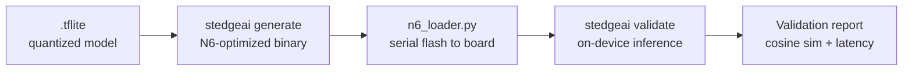

# Deployment

Deploy a quantized TFLite model to the STM32N6570-DK development board using
ST's X-CUBE-AI toolchain.

## Prerequisites

| Tool | Version | Download |
|---|---|---|
| X-CUBE-AI | 10.2.0+ | [ST website](https://www.st.com/en/embedded-software/x-cube-ai.html) |
| STM32CubeProgrammer | 2.20+ | [ST website](https://www.st.com/en/development-tools/stm32cubeprog.html) |
| STM32CubeIDE | 1.19+ | [ST website](https://www.st.com/en/development-tools/stm32cubeide.html) |
| ARM GNU Toolchain | 14.3+ | [ARM Developer](https://developer.arm.com/downloads/-/arm-gnu-toolchain-downloads) |

## Overview

The deployment pipeline has three stages:




*(Image source: [STM32ai](https://stm32ai-cs.st.com/assets/embedded-docs/stneuralart_getting_started.html))*

## Step 1: Install X-CUBE-AI

```bash
unzip x-cube-ai-linux-v10.2.0.zip X-CUBE-AI.10.2.0
cd X-CUBE-AI.10.2.0
unzip stedgeai-linux-10.2.0.zip
```

Directory structure after extraction:

```
X-CUBE-AI.10.2.0/
├── Utilities/
│   └── linux/
│       └── stedgeai          # CLI tool
├── Middlewares/
└── Projects/
```

## Step 2: Install ARM GNU Toolchain

```bash
wget https://developer.arm.com/-/media/Files/downloads/gnu/14.3.rel1/binrel/arm-gnu-toolchain-14.3.rel1-x86_64-arm-none-eabi.tar.xz
tar xf arm-gnu-toolchain-14.3.rel1-x86_64-arm-none-eabi.tar.xz
export PATH=$PWD/arm-gnu-toolchain-14.3.rel1-x86_64-arm-none-eabi/bin:$PATH
```

Verify:

```bash
arm-none-eabi-gcc --version
```

## Step 3: Install STM32CubeProgrammer

Download and run the installer:

```bash
./SetupSTM32CubeProgrammer-2.20.0.linux
```

Add to PATH and configure permissions:

```bash
export PATH=$PATH:/path/to/STM32Cube/STM32CubeProgrammer/bin

sudo usermod -aG plugdev $USER
sudo usermod -aG dialout $USER

# Install udev rules
sudo cp /path/to/STM32CubeProgrammer/Drivers/rules/*.* /etc/udev/rules.d/
sudo udevadm control --reload-rules && sudo udevadm trigger
```

Unplug and replug the board (or reboot) to apply the new rules.

Verify:

```bash
STM32_Programmer_CLI --list
```

## Step 4: Generate model files

Navigate to the X-CUBE-AI utilities directory and run:

```bash
./stedgeai generate \
  --model /path/to/checkpoints/my_model_quantized.tflite \
  --target stm32n6 \
  --st-neural-art \
  --output /path/to/birdnet-stm32/validation/st_ai_output \
  --workspace /path/to/birdnet-stm32/validation/st_ai_ws \
  --verbose
```

!!! tip "Analyze first"
    Run `stedgeai analyze` instead of `generate` to get detailed model metrics
    (size, memory, per-layer info) without generating output files. Always
    analyze new model architectures to verify N6 NPU operator compatibility.

The output includes `network_generate_report.txt` with model size and compute
requirements.

## Step 5: Configure and flash the board

### Set board to DEV mode

1. Disconnect the board from USB.
2. Set BOOT0 to right.
3. Set BOOT1 to left.
4. Set JP2 to position 1-2.
5. Reconnect the board.


*(Image source: [ST Community](https://community.st.com/t5/stm32-mcus/how-to-debug-stm32n6-using-stm32cubeide/ta-p/800547))*

### Create configuration files

Copy the example config and fill in your local paths:

```bash
cp config.example.json config.json
```

Edit `config.json` with your machine-local paths:

```json
{
  "compiler_type": "gcc",
  "cubeide_path": "/path/to/stm32cubeide",
  "x_cube_ai_path": "/path/to/X-CUBE-AI.10.2.0",
  "model_path": "checkpoints/best_model_quantized.tflite",
  "output_dir": "validation/st_ai_output",
  "workspace_dir": "validation/st_ai_ws",
  "n6_loader_config": "config_n6l.json"
}
```

Create `config_n6l.json` in the project root (required by ST's n6_loader):

```json
{
  "network.c": "/path/to/birdnet-stm32/validation/st_ai_output/network.c",
  "project_path": "/path/to/X-CUBE-AI.10.2.0/Projects/STM32N6570-DK/Applications/NPU_Validation",
  "project_build_conf": "N6-DK",
  "skip_external_flash_programming": false,
  "skip_ram_data_programming": false,
  "objcopy_binary_path": "/usr/bin/arm-none-eabi-objcopy"
}
```

!!! warning
    Both config files contain machine-local paths. They are listed in
    `.gitignore` — do not commit them. Use `config.example.json` as a
    reference template.

### Run the full deploy pipeline

The CLI reads all paths from `config.json` and runs generate → flash → validate:

```bash
python -m birdnet_stm32 deploy
```

You can override any path via CLI arguments:

```bash
python -m birdnet_stm32 deploy --x_cube_ai_path /path/to/X-CUBE-AI.10.2.0
```

Or via environment variables:

```bash
export X_CUBE_AI_PATH=/path/to/X-CUBE-AI.10.2.0
python -m birdnet_stm32 deploy
```

Priority order: CLI arguments > environment variables > `config.json` values.

Verify the board is connected:

```bash
ls /dev/ttyACM*
```

You may need serial port permissions:

```bash
sudo chmod a+rw /dev/ttyACM0
```

## Step 6: Validate on-device

The deploy command runs validation automatically. To run validation separately
with additional options (e.g., `--valinput` for specific test data):

```bash
/path/to/X-CUBE-AI.10.2.0/Utilities/linux/stedgeai validate \
  --model checkpoints/my_model_quantized.tflite \
  --target stm32n6 \
  --mode target \
  --desc serial:921600 \
  --output /path/to/birdnet-stm32/validation/st_ai_output \
  --workspace /path/to/birdnet-stm32/validation/st_ai_ws \
  --valinput /path/to/checkpoints/my_model_quantized_validation_data.npz \
  --classifier \
  --verbose
```

The validation runs inference on the physical board and compares results to the
reference model. Results are saved to `network_validate_report.txt` in the
output directory.

## Demo application

The demo application is under development. The planned pipeline:

1. Record audio using the on-board microphone.
2. Run FFT on 512-sample frames, accumulating into a ring buffer.
3. Run inference every second on the last 3 seconds of audio.
4. Map prediction scores to labels using `labels.txt`.
5. Log top-5 predictions to the serial console.

## Further reading

- [ST Edge AI CLI reference](https://stm32ai-cs.st.com/assets/embedded-docs/command_line_interface.html)
- [STM32N6 Getting Started guide](https://stm32ai-cs.st.com/assets/embedded-docs/stneuralart_getting_started.html)
- [STM32N6570-DK user manual (DM00570145)](https://www.st.com/resource/en/user_manual/dm00570145.pdf)
