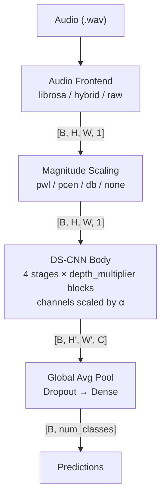
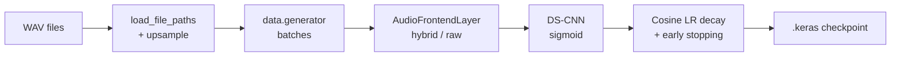
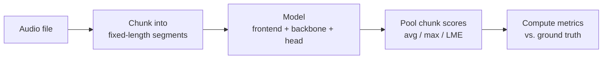
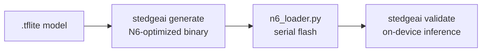

# Architecture

## Pipeline overview

## Component boundaries

| Component | Module | Responsibility |
|---|---|---|
| Audio I/O | `birdnet_stm32.audio.io` | Load, resample, chunk WAV files |
| Spectrogram | `birdnet_stm32.audio.spectrogram` | Compute mel spectrograms (librosa path) |
| Frontend layer | `birdnet_stm32.models.frontend` | In-graph frontend (hybrid/raw modes + mag scaling) |
| Model builder | `birdnet_stm32.models.dscnn` | DS-CNN construction with scaling knobs |
| Data pipeline | `birdnet_stm32.data.dataset` | File discovery, upsampling, tf.data generation |
| Training | `birdnet_stm32.training.trainer` | Training loop, LR schedule, callbacks |
| Conversion | `birdnet_stm32.conversion.quantize` | PTQ, representative dataset, TFLite export |
| Validation | `birdnet_stm32.conversion.validate` | Keras vs. TFLite output comparison |
| Evaluation | `birdnet_stm32.evaluation` | Pooling, metrics (ROC-AUC, cmAP, F1), reporting |
| Deployment | `birdnet_stm32.deploy` | Config resolution, stedgeai/n6_loader wrappers |

## Data flow

### Training

### Inference

### Deployment

## Key design decisions

- **Float32 I/O**: Audio spectrograms are continuous-valued; INT8 inputs would
  lose meaningful precision. Only internal weights/activations are quantized.
- **PWL over PCEN/dB**: Piecewise-linear magnitude scaling quantizes cleanly
  (no log ops, no running statistics). PCEN is acceptable; dB should be avoided.
- **Hybrid as default frontend**: Keeps the STFT offline (cheaper) while
  learning the mel projection in-graph, giving the TFLite model a complete
  mel-to-prediction path.
- **Channel alignment to 8**: The N6 NPU vectorizes in groups of 8. Misaligned
  channels waste compute cycles or fail compilation.
