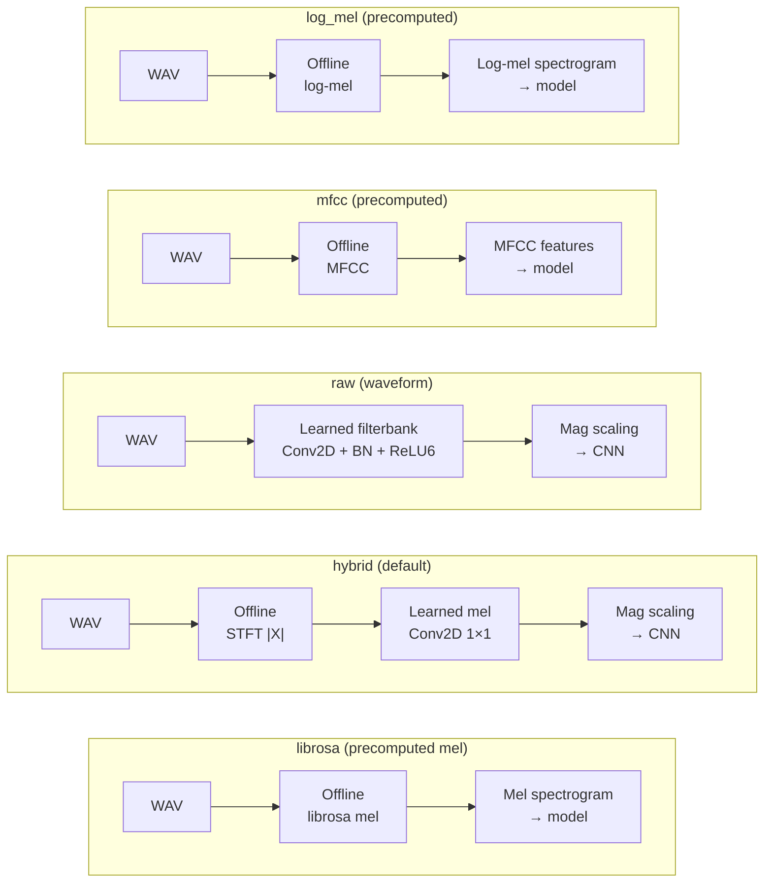

# Audio Frontends

The `AudioFrontendLayer` in `birdnet_stm32.models.frontend` implements five
audio frontend modes, each providing a different trade-off between flexibility
and deployment complexity.

Canonical names: `librosa`, `hybrid`, `raw`, `mfcc`, `log_mel`.
Deprecated aliases: `precomputed` → `librosa`, `tf` → `raw`.

## Frontend modes

### `librosa` (precomputed)

Spectrograms are computed offline using librosa before being fed to the model.
The model receives a ready-made mel spectrogram tensor.

- **Input**: `[B, num_mels, spec_width, 1]` mel spectrogram
- **In-graph ops**: magnitude scaling only (if enabled)
- **Pros**: simplest, fastest training
- **Cons**: frontend is not part of the TFLite model; preprocessing must be
  replicated on-device

### `hybrid` (default)

The model receives a linear magnitude STFT (`|STFT|`). A 1×1 Conv2D applies a
learned mel filter bank, optionally with magnitude scaling.

- **Input**: `[B, fft_bins, spec_width, 1]` linear magnitude spectrogram
- **In-graph ops**: mel projection (Conv2D) + magnitude scaling
- **Mel initialization**: weights seeded from a librosa Slaney mel basis
- **Trainable**: optionally via `--frontend_trainable`
- **Pros**: complete mel-to-prediction path in TFLite; flexible; good default
- **Cons**: requires offline STFT computation

### `raw` (waveform)

The model receives raw waveform samples and learns the entire filterbank from
scratch using Conv2D layers.

- **Input**: `[B, samples, 1]` raw audio waveform
- **In-graph ops**: learned Conv2D filterbank + BN + ReLU6 + magnitude scaling
- **Pros**: end-to-end learnable; no preprocessing needed
- **Cons**: highest memory usage; risk of exceeding activation limits

!!! danger "Raw frontend memory limit"
    At 22,050 Hz × 3 s = 66,150 samples, the raw input exceeds the 16-bit
    activation size limit (65,536) on the STM32N6 NPU. Either reduce the sample
    rate to 16 kHz, shorten the chunk, or use a different frontend.

### `mfcc` (precomputed)

Mel-frequency cepstral coefficients are computed offline before being fed to
the model. Useful for compact feature representations.

- **Input**: `[B, num_mfcc, spec_width, 1]` MFCC features
- **In-graph ops**: magnitude scaling only (if enabled)
- **Pros**: compact features, well-studied in speech/audio classification
- **Cons**: frontend is not part of the TFLite model; must be replicated on-device

### `log_mel` (precomputed)

Log-scaled mel spectrograms are computed offline before being fed to the model.

- **Input**: `[B, num_mels, spec_width, 1]` log-mel spectrogram
- **In-graph ops**: magnitude scaling only (if enabled)
- **Pros**: simple, standard feature representation
- **Cons**: frontend is not part of the TFLite model; must be replicated on-device

!!! note "Deployment frontends"
    Only `hybrid` and `raw` produce a self-contained TFLite model with the
    full audio-to-prediction path. The precomputed frontends (`librosa`,
    `mfcc`, `log_mel`) require matching preprocessing on the target device.

## Magnitude scaling

Magnitude scaling is applied after the mel projection (or filterbank) and
before the CNN body. It compresses the dynamic range of spectrogram values.

### `pwl` (piecewise-linear) — recommended

Learned piecewise-linear compression using depthwise convolution branches.
Quantizes cleanly — no log operations, no running statistics.

### `pcen` (per-channel energy normalization)

Applies automatic gain control per frequency band using a learned smoothing
filter. Uses pooling and convolution — generally N6-compatible but more complex
than PWL.

### `db` (decibels)

Log-scale compression: $20 \cdot \log_{10}(\text{mag} + \epsilon)$.

!!! warning
    Avoid `db` for quantized models. The log operation produces wide dynamic
    ranges that lead to poor INT8 quantization.

### `none`

No magnitude scaling. Useful as a baseline for comparison only.

## N6 compatibility checklist

When modifying or adding frontends, verify:

- [ ] Channel counts are multiples of 8
- [ ] No ops that expand beyond 16-bit activation limits
- [ ] All ops are in the [STM32N6 NPU operator set](https://stm32ai-cs.st.com/assets/embedded-docs/command_line_interface.html)
- [ ] Run `stedgeai analyze` on the exported TFLite to confirm
- [ ] Cosine similarity > 0.95 after quantization
