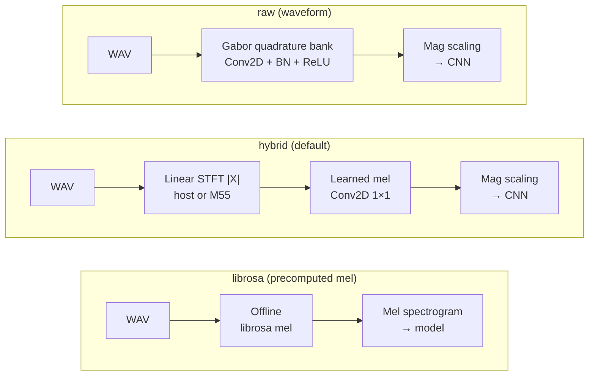

# Audio Frontends

The `AudioFrontendLayer` in `birdnet_stm32.models.frontend` implements three
audio frontend modes, each providing a different trade-off between flexibility
and deployment complexity.

Canonical names: `librosa`, `hybrid`, `raw`. The `mfcc` and `log_mel` modes were
removed in 1.2.0: both were host-precomputed variants of the `librosa` path and
no release ever used them.

```mermaid
flowchart LR
    subgraph librosa ["librosa (precomputed mel)"]
        direction LR
        L1["WAV"] --> L2["Offline\nlibrosa mel"] --> L3["Mel spectrogram\n→ model"]
    end
    subgraph hybrid ["hybrid (default)"]
        direction LR
        H1["WAV"] --> H2["Linear STFT |X|\nhost or M55"] --> H3["Learned mel\nConv2D 1×1"] --> H4["Mag scaling\n→ CNN"]
    end
    subgraph raw ["raw (waveform)"]
        direction LR
        R1["WAV"] --> R2["Gabor quadrature bank\nConv2D + BN + ReLU"] --> R3["Mag scaling\n→ CNN"]
    end
```

## Frontend modes

### `librosa` (precomputed)

Spectrograms are computed offline using librosa before being fed to the model.
The model receives a ready-made mel spectrogram tensor.

- **Input**: `[B, num_mels, spec_width, 1]` mel spectrogram
- **In-graph ops**: magnitude scaling only (if enabled)
- **Pros**: simplest, fastest training
- **Cons**: frontend is not part of the TFLite model; preprocessing must be
  replicated on-device

### `hybrid` (default)

The model receives a linear magnitude STFT (`|STFT|`). A 1×1 Conv2D applies a
learned mel filter bank, optionally with magnitude scaling.

- **Input**: `[B, fft_length // 2, spec_width, 1]` linear magnitude spectrogram
- **In-graph ops**: mel projection (Conv2D) + magnitude scaling
- **Mel initialization**: weights seeded from a librosa Slaney mel basis
- **Trainable**: optionally via `--frontend_trainable`
- **Pros**: mel projection is trainable and travels with the model; good default
- **Cons**: requires STFT outside the graph (host-side for training/evaluation,
  Cortex-M55 in the standalone firmware)

### `raw` (waveform)

The model receives raw waveform samples and computes the spectrogram itself
with a learned **Gabor quadrature filterbank**.

- **Input**: `[B, samples, 1]` raw audio waveform (peak-normalized)
- **In-graph ops**: fold → cosine/sine Conv2D pair → magnitude → per-band
  temporal lowpass → BN → ReLU → magnitude scaling
- **Pros**: end-to-end learnable; no host-side STFT at all
- **Cons**: highest activation memory; chunk length bounded by the 65,536 limit

**How it is laid out.** Each of the `mel_bins` filters is a Gaussian-windowed
complex exponential centred on a mel frequency, learned as a cosine/sine pair.
Their magnitude is combined as `max(|re|,|im|) + 0.4·min(|re|,|im|)`, which is
within ~4% of the true modulus while staying INT8-friendly. The bank starts
from mel-spaced Gabor atoms, so training refines a useful spectral
initialization rather than starting from noise.

The waveform is first *folded* into `hop/2` interleaved channels. This is free —
NHWC memory is contiguous, so `[T, 1]` and `[T/fold, fold]` are the same bytes —
but it turns a long, large-stride, single-channel convolution into a stride-2
convolution over a full channel group. That matters: **the N6 runs convolutions
with stride > 2 in software**, so without the fold the entire filterbank
executes on the Cortex-M55 rather than the NPU.

Two invariants the geometry guarantees, both covered by tests:

- `window >= hop`, so every input sample reaches at least one output frame.
- folded `stride == 2` and `fold % 8 == 0`, so the convolution stays on the NPU.

!!! danger "Raw frontend memory limit"
    The raw input array must stay below the 16-bit activation size limit
    (65,536 samples) on the STM32N6 NPU. At 24 kHz that caps the chunk at
    ~2.7 s — 2.5 s is a comfortable default. Longer chunks need a lower sample
    rate or a different frontend.

!!! danger "The raw filterbank does not currently compute correctly on the NPU"
    Measured 2026-09-09 with `stedgeai validate --mode target`. The filterbank
    convolution — 112 input channels x 1x4 kernel, 448 taps — returns wrong
    results on device while every stage before it is bit-exact:

    | node | target vs host |
    |---|---|
    | `slice_1` (the folded waveform) | cos **1.000000** |
    | `conv2d_3` (the filterbank) | cos **0.683** |

    Only 18 of 64 filters are correct. Recovering the kernel the device
    actually used shows filters built from many small taps are attenuated or
    dead (filter 0: 428 non-zero taps, cos 0.003 against its true kernel) while
    filters built from a few large taps are exact (filter 61: 44 taps,
    cos 1.000). `corr(gain, non-zero taps) = -0.87`.

    The same geometry with random, uniform, sparsity-matched or
    wide-scale-spread weights all validate at cos 0.9999. Only the *trained*
    filterbank fails, and shuffling its values keeps it failing — being matched
    filters, they accumulate coherently on real audio in a way random weights
    do not. Scaling the input down recovers it (full 0.756, 1/4 0.964,
    1/8 0.995), but at a real accuracy cost.

    This is not a general NPU or backbone problem: a `hybrid` model validates
    on target at **cos 1.000000, rmse 0.000000** — bit-exact, whole model,
    DS-CNN backbone included.

    **Until this is resolved, deploy with `hybrid`.** It is measured exact on
    device. Note the defect predates the current code and affects shipped raw
    models, which were selected on host metrics plus board *timing* — on-board
    numerical accuracy had never been checked.

    Two tools ship with the repository:

    - `scripts/npu_conv_repro.py` builds a single-Conv2D model with this
      geometry and selectable weights, so the failure can be reproduced (and
      reported to ST) without the rest of the network.
    - `scripts/patch_waveform_scale.py` widens the scale of the int8 waveform
      tensors feeding the filterbank, which shrinks the input codes and the
      accumulation with them. At 32x headroom the layer reaches cos 0.99988 on
      target, but the waveform is left with ~4 int8 codes and host top-1 falls
      from 25/25 to 22/25 on a 25-species check. It confirms the mechanism; it
      is not a shippable fix.

## Magnitude scaling

Magnitude scaling is applied after the mel projection (or filterbank) and
before the CNN body. It compresses the dynamic range of spectrogram values.

### `pwl` (piecewise-linear) — recommended

Learned piecewise-linear compression using depthwise convolution branches.
Quantizes cleanly — no log operations, no running statistics.

### `none`

No magnitude scaling. Useful as a baseline for comparison only.

## N6 compatibility checklist

When modifying or adding frontends, verify:

- [ ] Channel counts are multiples of 8
- [ ] No ops that expand beyond 16-bit activation limits
- [ ] All ops are in the [STM32N6 NPU operator set](https://stm32ai-cs.st.com/assets/embedded-docs/command_line_interface.html)
- [ ] Run `stedgeai analyze` on the exported TFLite to confirm
- [ ] Run `stedgeai validate --mode target` on the exported TFLite and check the
      cross-accuracy, **with the trained weights** — see
      [Validate on-device](../deployment.md#step-6-validate-on-device)

That last item is not optional. `analyze` reports operator coverage and memory,
not arithmetic: a layer can compile entirely to the NPU, report plausible
timings, and still return wrong numbers. It is also weight-dependent, so a
geometry that validates with random weights can still fail once trained — the
raw filterbank above is exactly that case.
- [ ] Cosine similarity > 0.95 after quantization
