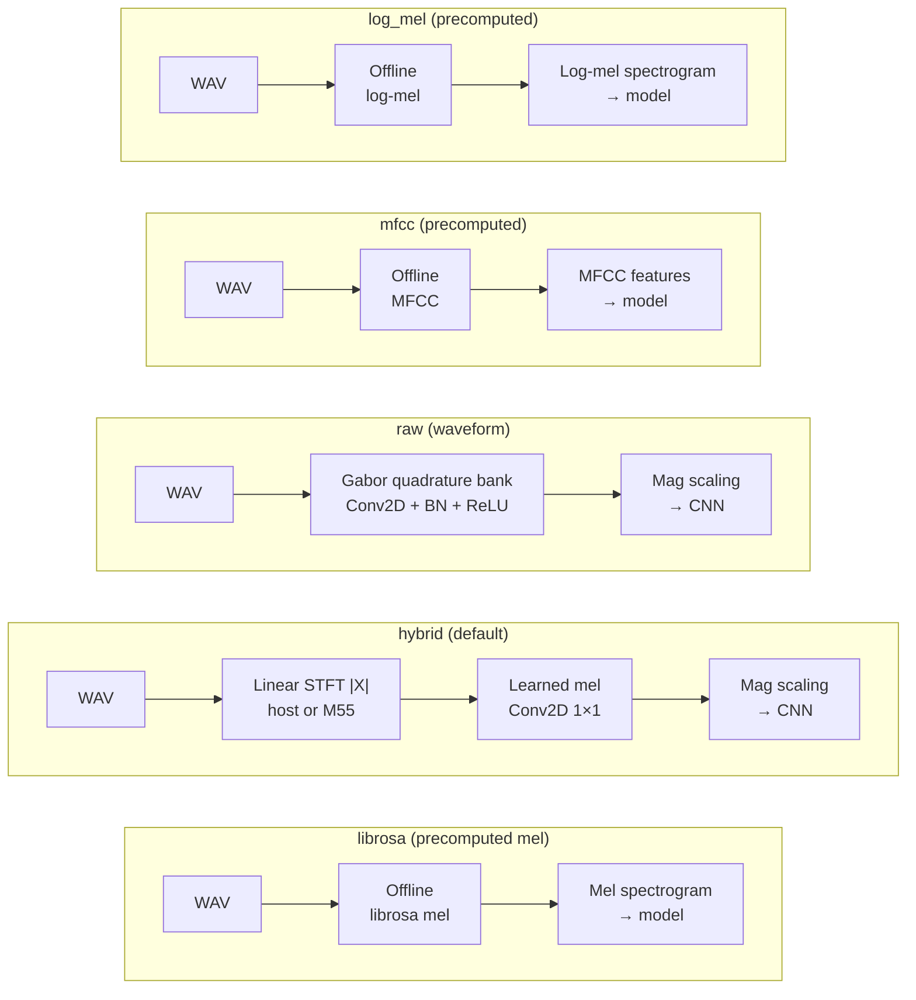

# Audio Frontends

The `AudioFrontendLayer` in `birdnet_stm32.models.frontend` implements five
audio frontend modes, each providing a different trade-off between flexibility
and deployment complexity.

Canonical names: `librosa`, `hybrid`, `raw`, `mfcc`, `log_mel`.

```mermaid
flowchart LR
    subgraph librosa ["librosa (precomputed mel)"]
        direction LR
        L1["WAV"] --> L2["Offline\nlibrosa mel"] --> L3["Mel spectrogram\n→ model"]
    end
    subgraph hybrid ["hybrid (default)"]
        direction LR
        H1["WAV"] --> H2["Linear STFT |X|\nhost or M55"] --> H3["Learned mel\nConv2D 1×1"] --> H4["Mag scaling\n→ CNN"]
    end
    subgraph raw ["raw (waveform)"]
        direction LR
        R1["WAV"] --> R2["Gabor quadrature bank\nConv2D + BN + ReLU"] --> R3["Mag scaling\n→ CNN"]
    end
    subgraph mfcc ["mfcc (precomputed)"]
        direction LR
        M1["WAV"] --> M2["Offline\nMFCC"] --> M3["MFCC features\n→ model"]
    end
    subgraph log_mel ["log_mel (precomputed)"]
        direction LR
        LM1["WAV"] --> LM2["Offline\nlog-mel"] --> LM3["Log-mel spectrogram\n→ model"]
    end
```

## Frontend modes

### `librosa` (precomputed)

Spectrograms are computed offline using librosa before being fed to the model.
The model receives a ready-made mel spectrogram tensor.

- **Input**: `[B, num_mels, spec_width, 1]` mel spectrogram
- **In-graph ops**: magnitude scaling only (if enabled)
- **Pros**: simplest, fastest training
- **Cons**: frontend is not part of the TFLite model; preprocessing must be
  replicated on-device

### `hybrid` (default)

The model receives a linear magnitude STFT (`|STFT|`). A 1×1 Conv2D applies a
learned mel filter bank, optionally with magnitude scaling.

- **Input**: `[B, fft_length // 2, spec_width, 1]` linear magnitude spectrogram
- **In-graph ops**: mel projection (Conv2D) + magnitude scaling
- **Mel initialization**: weights seeded from a librosa Slaney mel basis
- **Trainable**: optionally via `--frontend_trainable`
- **Pros**: mel projection is trainable and travels with the model; good default
- **Cons**: requires STFT outside the graph (host-side for training/evaluation,
  Cortex-M55 in the standalone firmware)

### `raw` (waveform)

The model receives raw waveform samples and computes the spectrogram itself
with a learned **Gabor quadrature filterbank**.

- **Input**: `[B, samples, 1]` raw audio waveform (peak-normalized)
- **In-graph ops**: fold → cosine/sine Conv2D pair → magnitude → per-band
  temporal lowpass → BN → ReLU → magnitude scaling
- **Pros**: end-to-end learnable; no host-side STFT at all
- **Cons**: highest activation memory; chunk length bounded by the 65,536 limit

**How it is laid out.** Each of the `mel_bins` filters is a Gaussian-windowed
complex exponential centred on a mel frequency, learned as a cosine/sine pair.
Their magnitude is combined as `max(|re|,|im|) + 0.4·min(|re|,|im|)`, which is
within ~4% of the true modulus while staying INT8-friendly. The bank starts
from mel-spaced Gabor atoms, so training refines a useful spectral
initialization rather than starting from noise.

The waveform is first *folded* into `hop/2` interleaved channels. This is free —
NHWC memory is contiguous, so `[T, 1]` and `[T/fold, fold]` are the same bytes —
but it turns a long, large-stride, single-channel convolution into a stride-2
convolution over a full channel group. That matters: **the N6 runs convolutions
with stride > 2 in software**, so without the fold the entire filterbank
executes on the Cortex-M55 rather than the NPU.

Two invariants the geometry guarantees, both covered by tests:

- `window >= hop`, so every input sample reaches at least one output frame.
- folded `stride == 2` and `fold % 8 == 0`, so the convolution stays on the NPU.

!!! danger "Raw frontend memory limit"
    The raw input array must stay below the 16-bit activation size limit
    (65,536 samples) on the STM32N6 NPU. At 24 kHz that caps the chunk at
    ~2.7 s — 2.5 s is a comfortable default. Longer chunks need a lower sample
    rate or a different frontend.

### `mfcc` (precomputed)

Mel-frequency cepstral coefficients are computed offline before being fed to
the model. Useful for compact feature representations.

- **Input**: `[B, num_mfcc, spec_width, 1]` MFCC features
- **In-graph ops**: magnitude scaling only (if enabled)
- **Pros**: compact features, well-studied in speech/audio classification
- **Cons**: frontend is not part of the TFLite model; must be replicated on-device

### `log_mel` (precomputed)

Log-scaled mel spectrograms are computed offline before being fed to the model.

- **Input**: `[B, num_mels, spec_width, 1]` log-mel spectrogram
- **In-graph ops**: magnitude scaling only (if enabled)
- **Pros**: simple, standard feature representation
- **Cons**: frontend is not part of the TFLite model; must be replicated on-device

!!! note "Deployment frontends"
    `raw` is the only TFLite path whose input is waveform audio. The standalone
    firmware also deploys `hybrid` by computing STFT on the M55 and `librosa`
    by computing STFT + mel on the M55. `mfcc` and `log_mel` require matching
    preprocessing outside the supplied firmware.

## Magnitude scaling

Magnitude scaling is applied after the mel projection (or filterbank) and
before the CNN body. It compresses the dynamic range of spectrogram values.

### `pwl` (piecewise-linear) — recommended

Learned piecewise-linear compression using depthwise convolution branches.
Quantizes cleanly — no log operations, no running statistics.

### `pcen` (per-channel energy normalization)

Applies automatic gain control per frequency band using a learned smoothing
filter. Uses pooling and convolution — generally N6-compatible but more complex
than PWL.

### `db` (decibels)

Log-scale compression: $20 \cdot \log_{10}(\text{mag} + \epsilon)$.

!!! warning
    Avoid `db` for quantized models. The log operation produces wide dynamic
    ranges that lead to poor INT8 quantization.

### `none`

No magnitude scaling. Useful as a baseline for comparison only.

## N6 compatibility checklist

When modifying or adding frontends, verify:

- [ ] Channel counts are multiples of 8
- [ ] No ops that expand beyond 16-bit activation limits
- [ ] All ops are in the [STM32N6 NPU operator set](https://stm32ai-cs.st.com/assets/embedded-docs/command_line_interface.html)
- [ ] Run `stedgeai analyze` on the exported TFLite to confirm
- [ ] Cosine similarity > 0.95 after quantization
