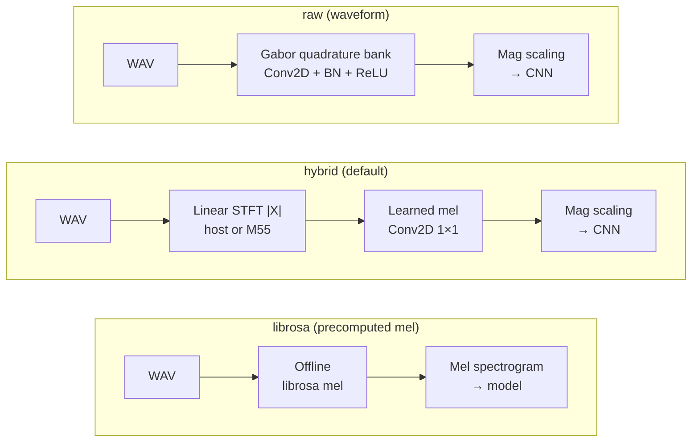

# Audio Frontends

The `AudioFrontendLayer` in `birdnet_stm32.models.frontend` implements three
audio frontend modes, each providing a different trade-off between flexibility
and deployment complexity.

Canonical names: `librosa`, `hybrid`, `raw`. The `mfcc` and `log_mel` modes were
removed in 1.2.0: both were host-precomputed variants of the `librosa` path and
no release ever used them.

```mermaid
flowchart LR
    subgraph librosa ["librosa (precomputed mel)"]
        direction LR
        L1["WAV"] --> L2["Offline\nlibrosa mel"] --> L3["Mel spectrogram\n→ model"]
    end
    subgraph hybrid ["hybrid (default)"]
        direction LR
        H1["WAV"] --> H2["Linear STFT |X|\nhost or M55"] --> H3["Learned mel\nConv2D 1×1"] --> H4["Mag scaling\n→ CNN"]
    end
    subgraph raw ["raw (waveform)"]
        direction LR
        R1["WAV"] --> R2["Gabor quadrature bank\nConv2D + BN + ReLU"] --> R3["Mag scaling\n→ CNN"]
    end
```

## Frontend modes

### `librosa` (precomputed)

Spectrograms are computed offline using librosa before being fed to the model.
The model receives a ready-made mel spectrogram tensor.

- **Input**: `[B, num_mels, spec_width, 1]` mel spectrogram
- **In-graph ops**: magnitude scaling only (if enabled)
- **Pros**: simplest, fastest training
- **Cons**: frontend is not part of the TFLite model; preprocessing must be
  replicated on-device

### `hybrid` (default)

The model receives a linear magnitude STFT (`|STFT|`). A 1×1 Conv2D applies a
learned mel filter bank, optionally with magnitude scaling.

- **Input**: `[B, fft_length // 2, spec_width, 1]` linear magnitude spectrogram
- **In-graph ops**: mel projection (Conv2D) + magnitude scaling
- **Mel initialization**: weights seeded from a librosa Slaney mel basis
- **Trainable**: optionally via `--frontend_trainable`
- **Pros**: mel projection is trainable and travels with the model; good default
- **Cons**: requires STFT outside the graph (host-side for training/evaluation,
  Cortex-M55 in the standalone firmware)

### `raw` (waveform)

The model receives raw waveform samples and computes the spectrogram itself
with a learned **Gabor quadrature filterbank**.

- **Input**: `[B, samples, 1]` raw audio waveform (peak-normalized)
- **In-graph ops**: fold → cosine/sine filterbank (each as `RAW_SPLIT`
  channel-group convolutions, summed) → magnitude → per-band temporal
  lowpass → BN → ReLU → magnitude scaling
- **Pros**: end-to-end learnable; no host-side STFT at all
- **Cons**: highest activation memory; chunk length bounded by the 65,536 limit

**How it is laid out.** Each of the `mel_bins` filters is a Gaussian-windowed
complex exponential centred on a mel frequency, learned as a cosine/sine pair.
Their magnitude is combined as `max(|re|,|im|) + 0.4·min(|re|,|im|)`, which is
within ~4% of the true modulus while staying INT8-friendly. The bank starts
from mel-spaced Gabor atoms, so training refines a useful spectral
initialization rather than starting from noise.

The waveform is first *folded* into `hop/2` interleaved channels. This is free —
NHWC memory is contiguous, so `[T, 1]` and `[T/fold, fold]` are the same bytes —
but it turns a long, large-stride, single-channel convolution into a stride-2
convolution over a full channel group. That matters: **the N6 runs convolutions
with stride > 2 in software**, so without the fold the entire filterbank
executes on the Cortex-M55 rather than the NPU.

Two invariants the geometry guarantees, both covered by tests:

- `window >= hop`, so every input sample reaches at least one output frame.
- folded `stride == 2` and `fold % 8 == 0`, so the convolution stays on the NPU.

!!! danger "Raw frontend memory limit"
    The raw input array must stay below the 16-bit activation size limit
    (65,536 samples) on the STM32N6 NPU. At 24 kHz that caps the chunk at
    ~2.7 s — 2.5 s is a comfortable default. Longer chunks need a lower sample
    rate or a different frontend.

!!! warning "Two NPU defects the raw path is built around"
    The raw frontend is shaped by two defects in how the STM32N6 NPU computes,
    both found and measured on hardware 2026-09-09 with
    `stedgeai validate --mode target`. Neither shows up in `stedgeai analyze`,
    in board timings, or on background audio.

    **1. Long filterbank convolutions are miscomputed.** Emitted as a single
    convolution — 112 input channels x 1x4 kernel, 448 taps — the trained
    filterbank comes back wrong (cos 0.683 at that layer, while every stage
    before it is bit-exact). The failing filters are the ones whose energy is
    spread over many taps: the low mel bands, whose Gabor atoms span the whole
    window. Filter 0 (428 non-zero taps) matches its true kernel at cos 0.003;
    filter 61 (44 taps) at cos 1.000. Random, uniform, sparsity-matched and
    wide-scale-spread weights all validate at 0.9999 with the same geometry,
    so a random-weight check does not catch it.

    The fix is `RAW_SPLIT` in `birdnet_stm32/models/frontend.py`: each
    quadrature filterbank is emitted as parallel convolutions over equal groups
    of the folded channels, then summed. That is an exact decomposition — the
    model computes the same function — but each partial convolution
    accumulates fewer taps. Filterbank output on target, trained weights:

    | `RAW_SPLIT` | taps per conv | cos |
    |---|---|---|
    | 1 | 448 | 0.756 |
    | 2 | 224 | 0.864 |
    | **4** (default) | **112** | **0.99956** |
    | 8 | 56 | 0.99950 |

    8 is no better than 4; what remains at 4 is the INT8 requantization of the
    sum, not the defect.

    **2. `ABS` ignores its input's zero-point.** An isolated `ABS` on a tensor
    with zero-point -9 returns every element short by `|zp| * scale`: mean
    error -0.1543 against a mean absolute error of 0.1543, i.e. pure bias
    (cos 0.951). The filterbank sums feeding the magnitude never have a zero
    zero-point, so the frontend computes `|x|` as `relu(x) + (relu(x) - x)`.
    That is the identity `relu(x) + relu(-x)` written without a negation, and
    the difference is not cosmetic: TFLite has no INT8 negate, so `-x` lowers
    to a DEQUANTIZE → NEG → QUANTIZE round trip that runs in software on the
    Cortex-M55 — six extra software epochs, about 2.0 of 6.7 ms per inference
    at 1 GHz, in the 100-class model. ReLU, SUB and ADD all stay on the NPU,
    and the SUB form is bit-exact on target (cos 1.000000, l2r 0.00036).

    **Result.** Full 25-species model, `stedgeai validate` on target: cos
    0.285 originally, 0.526 with the split alone, **0.999747** with both. On a
    25-file board test of audio the host classifies confidently, the board
    matches the host's top-1 on **25/25** files, scores within 0.031.

    Cost, measured on the 100-class C1a architecture against its unsplit
    graph: +0.31% MACs (43.38 M → 43.51 M), +1.7 kB weights, activation memory
    unchanged at 292.969 kB, 47 → 58 epochs, and still only the three software
    epochs every model has (`QuantizeLinear`, `Transpose`, `DequantizeLinear`).
    Writing `|x|` as `relu(x) + relu(-x)` instead would have made it 64 epochs,
    nine of them in software.

    **Raw checkpoints from before this change cannot be loaded** — each
    filterbank is now `RAW_SPLIT` convolutions rather than one — and every raw
    model released before it (v1.0, v1.1, and the C1a candidate) computes
    wrong results on the device. Those have to be retrained. `hybrid` was never
    affected: it has neither a long filterbank nor an `ABS`, and validates
    bit-exactly on target (cos 1.000000, rmse 0.000000).

    `scripts/npu_conv_repro.py` reproduces defect 1 in a single Conv2D, for
    reporting upstream.

## Magnitude scaling

Magnitude scaling is applied after the mel projection (or filterbank) and
before the CNN body. It compresses the dynamic range of spectrogram values.

### `pwl` (piecewise-linear) — recommended

Learned piecewise-linear compression using depthwise convolution branches.
Quantizes cleanly — no log operations, no running statistics.

### `cpwl` (compressive piecewise-linear) — experimental

The same hinge sum as `pwl`, with the same ops and layer names, but held
compressive: the linear gain and hinge input weights are constrained to be
non-negative and the hinge slopes non-positive, and the initial curve is
log-like (slope 1.0, falling to 0.55, 0.25 and 0.10 at the hinges) rather than
`pwl`'s expansive one (0.40 rising to 0.88).

The reason is INT8 resolution. `pwl` starts expansive and stays so, which
gives its output a heavy upper tail: in the 25-species raw model (V12), 50, 90
and 99% of the layer's output values fall into 1, 3 and 14 of the 255 INT8
codes, because the rare peaks set the quantization range. A concave curve
squeezes that tail, so typical values keep more codes. Whether that closes the
float-to-INT8 gap is being measured; until then `pwl` stays the default.

### `none`

No magnitude scaling. Useful as a baseline for comparison only.

## N6 compatibility checklist

When modifying or adding frontends, verify:

- [ ] Channel counts are multiples of 8
- [ ] No ops that expand beyond 16-bit activation limits
- [ ] No `ABS` on a tensor whose zero-point can be non-zero — use
      `relu(x) + (relu(x) - x)`, and not `relu(-x)`, whose negation runs in
      software (see the raw section above)
- [ ] All ops are in the [STM32N6 NPU operator set](https://stm32ai-cs.st.com/assets/embedded-docs/command_line_interface.html)
- [ ] Run `stedgeai analyze` on the exported TFLite to confirm
- [ ] Run `stedgeai validate --mode target` on the exported TFLite and check the
      cross-accuracy, **with the trained weights** — see
      [Validate on-device](../deployment.md#step-6-validate-on-device)

That last item is not optional. `analyze` reports operator coverage and memory,
not arithmetic: a layer can compile entirely to the NPU, report plausible
timings, and still return wrong numbers. It is also weight-dependent, so a
geometry that validates with random weights can still fail once trained — the
raw filterbank above is exactly that case.

Pair `cos` with an absolute error. Cosine is scale-invariant, so a layer that
keeps the right shape but loses gain or picks up a constant offset can still
score close to 1: the isolated `ABS` defect scored cos 0.951 with a mean
absolute error of 0.154, all of it bias. Use `mae` for that, not `l2r`. `l2r`
divides by the norm of the reference, which for a sparse multi-label output is
small, so it inflates harmless rounding: the correct 100-class raw model reads
l2r 0.108 at mae 0.0017, under one output LSB.
- [ ] Cosine similarity > 0.95 after quantization
