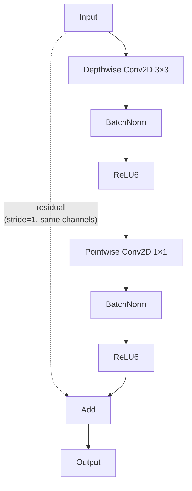

# Model

## DS-CNN architecture

The backbone is a depthwise-separable convolutional neural network (DS-CNN)
with 4 stages, inspired by MobileNetV1.

### Block structure

Each depthwise-separable block:

When `stride=1` and input/output channels match, a **residual skip connection**
is added.

### Stage configuration

| Stage | Output channels | Stride | Repeats |
|---|---|---|---|
| 1 | 64 × alpha | 2 | 1 × depth_multiplier |
| 2 | 128 × alpha | 2 | 1 × depth_multiplier |
| 3 | 256 × alpha | 2 | 1 × depth_multiplier |
| 4 | 512 × alpha | 2 | 1 × depth_multiplier |

All channel counts are rounded to the nearest multiple of 8 via
`_make_divisible(channels, 8)`.

### Head

After the final stage:

1. **Global Average Pooling** over spatial dimensions
2. **Dropout** (0.5)
3. **Dense** with sigmoid activation → `[B, num_classes]`

## Scaling knobs

### `alpha` (width multiplier)

Scales channel counts across all stages. Default 1.0.

| alpha | Stage 1 | Stage 2 | Stage 3 | Stage 4 | Relative params |
|---|---|---|---|---|---|
| 0.25 | 16 | 32 | 64 | 128 | ~6% |
| 0.5 | 32 | 64 | 128 | 256 | ~25% |
| 1.0 | 64 | 128 | 256 | 512 | 100% |
| 1.5 | 96 | 192 | 384 | 768 | ~225% |

### `depth_multiplier` (block repeats)

Repeats each DS block within a stage. Default 1. Only the first block in each
stage uses stride 2; subsequent blocks use stride 1 with residual connections.

## N6 NPU constraints

!!! danger "N6 compatibility is the absolute priority"
    Every model architecture change must be validated against the STM32N6 NPU
    operator set. Always run `stedgeai analyze` before committing model changes.

Key constraints:

- **Channel alignment**: all channel counts must be multiples of 8 for NPU
  vectorization.
- **Supported ops**: Conv2D, DepthwiseConv2D, BatchNormalization, ReLU6,
  GlobalAveragePooling2D, Dense, Add (residuals). Verify exotic ops with
  `stedgeai analyze`.
- **Activation memory**: intermediate activations must fit in NPU SRAM. Large
  spatial dimensions or channel counts may exceed limits.
- **No QAT artifacts**: quantization-aware training may leave fake-quant nodes
  or unsupported fused ops that prevent deployment. Use PTQ unless QAT is
  explicitly verified against the N6.
