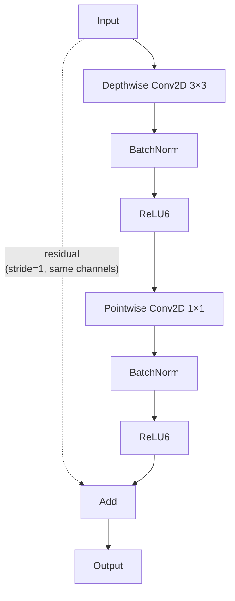

# Model

## DS-CNN architecture

The backbone is a depthwise-separable convolutional neural network (DS-CNN)
with 4 stages, inspired by MobileNetV1. All variants are built by the single
`build_dscnn_model()` function in `birdnet_stm32/models/dscnn.py` and
registered via the model registry (`build_model("dscnn", ...)`).

### Block structure

Each depthwise-separable block (default):

When `stride=1` and input/output channels match, a **residual skip connection**
is added.

#### Inverted residual blocks (`--use_inverted_residual`)

When enabled, each DS block is replaced by an inverted residual block
(MobileNetV2-style): expand → depthwise 3×3 → project, with ReLU6
activations and a residual skip when stride=1 and channels match. Controlled
by `--expansion_factor` (default 4).

#### SE channel attention (`--use_se`)

Adds a squeeze-and-excitation block after each DS or inverted residual block.
The SE ratio is set via `--se_reduction` (default 4).

### Stage configuration

| Stage | Output channels | Stride | Repeats |
|---|---|---|---|
| 1 | 64 × alpha | 2 | 1 × depth_multiplier |
| 2 | 128 × alpha | 2 | 1 × depth_multiplier |
| 3 | 256 × alpha | 2 | 1 × depth_multiplier |
| 4 | 512 × alpha | 2 | 1 × depth_multiplier |

All channel counts are rounded to the nearest multiple of 8 via
`_make_divisible(channels, 8)` (defined in `birdnet_stm32/models/blocks.py`).

### Head

After the final stage:

1. **Global Average Pooling** (or **Attention Pooling** with `--use_attention_pooling`)
2. **Dropout** (0.5)
3. **Dense** with sigmoid activation → `[B, num_classes]`

Attention pooling learns per-channel weights before averaging, giving the
model a soft spatial attention mechanism while remaining NPU-compatible.

## Building blocks

All reusable building blocks live in `birdnet_stm32/models/blocks.py`:

- `_make_divisible(v, divisor)` — round channel counts to multiples of `divisor`
- `se_block(x, ratio)` — squeeze-and-excitation channel attention
- `inverted_residual_block(x, filters, stride, expansion)` — MobileNetV2-style block
- `AttentionPooling` — Keras Layer that learns per-channel spatial attention weights

## Scaling knobs

### `alpha` (width multiplier)

Scales channel counts across all stages. Default 1.0.

| alpha | Stage 1 | Stage 2 | Stage 3 | Stage 4 | Relative params |
|---|---|---|---|---|---|
| 0.25 | 16 | 32 | 64 | 128 | ~6% |
| 0.5 | 32 | 64 | 128 | 256 | ~25% |
| 1.0 | 64 | 128 | 256 | 512 | 100% |
| 1.5 | 96 | 192 | 384 | 768 | ~225% |

### `depth_multiplier` (block repeats)

Repeats each DS block within a stage. Default 1. Only the first block in each
stage uses stride 2; subsequent blocks use stride 1 with residual connections.

## Model profiler

Use `birdnet_stm32/models/profiler.py` to analyze a model before deployment:

- `profile_model(model)` — per-layer MACs, params, and activation memory
- `check_n6_compatibility(model)` — flags layers using ops outside the N6 NPU
  supported set

## N6 NPU constraints

!!! danger "N6 compatibility is the absolute priority"
    Every model architecture change must be validated against the STM32N6 NPU
    operator set. Always run `stedgeai analyze` before committing model changes.

Key constraints:

- **Channel alignment**: all channel counts must be multiples of 8 for NPU
  vectorization.
- **Supported ops**: Conv2D, DepthwiseConv2D, BatchNormalization, ReLU6,
  GlobalAveragePooling2D, Dense, Add, Multiply (SE), Reshape, Sigmoid.
  Verify exotic ops with `stedgeai analyze`.
- **Activation memory**: intermediate activations must fit in NPU SRAM. Large
  spatial dimensions or channel counts may exceed limits.
- **QAT is safe**: the shadow-weight QAT implementation (`--qat`) does not
  leave FakeQuant ops in the saved model, so the resulting `.keras` file is
  fully N6-compatible after standard PTQ conversion.
