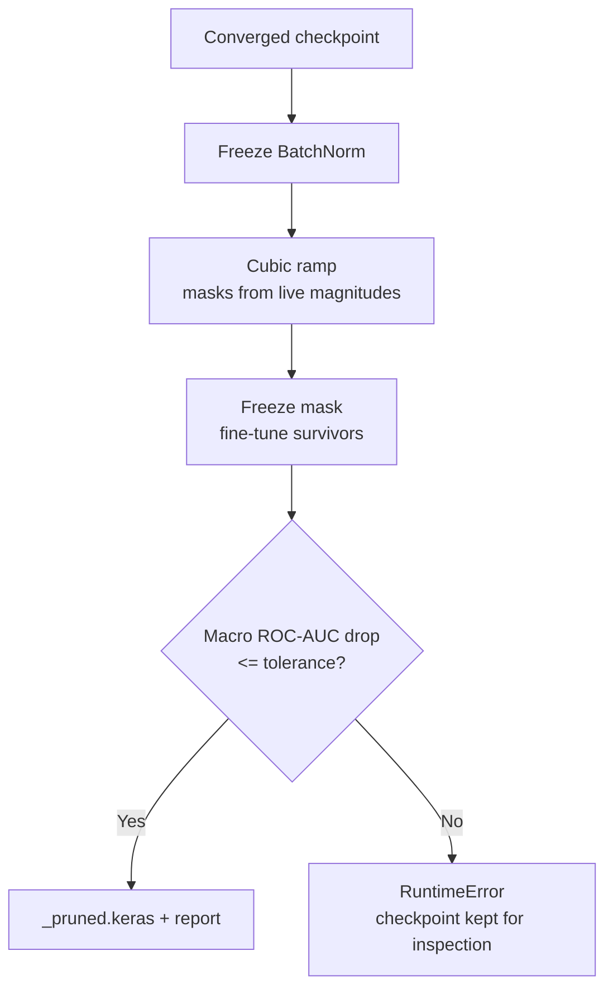

# Pruning

## Strategy

`birdnet_stm32/training/pruning.py` implements **gradual magnitude pruning**
(Zhu & Gupta, 2017) as a separate fine-tuning step, structurally parallel to
QAT: load a converged checkpoint, fine-tune it under a growing perturbation,
and write a clean deployment checkpoint with no training-only wrappers.

The sparsity is **unstructured** — individual weights, not whole channels.
That choice is deliberate and has a cost:

| Aspect | Effect on STM32N6 |
|---|---|
| `.tflite` size | Unchanged. TFLite stores INT8 kernels densely. |
| Compressed / OTA size | ~20% smaller gzipped at 50% sparsity. |
| NPU latency | Unchanged. ST Neural-ART runs dense kernels and does not skip zeros. |
| Accuracy | Held to a configured tolerance by a hard gate (see below). |

Structured channel pruning would reduce MACs and latency, but the DS-CNN's
residual adds tie the block output widths together, `_make_divisible(8)` fixes
the NPU-aligned channel counts, and `ModelConfig` carries a single global
`expansion_factor` rather than per-block widths. Removing channels therefore
means rebuilding the architecture, not masking it. Reducing `--alpha` or
`--depth_multiplier` and retraining is the supported way to buy latency today.

## What is prunable

`select_prunable_layers()` keeps a layer only if all of these hold:

1. It is a `Conv2D` and not a `DepthwiseConv2D`, **or** it is the `Dense` layer
   that produces the model output (`classifier_head_layer()` finds it by
   matching against `model.outputs`, so squeeze-and-excite `Dense` gates never
   qualify).
2. It is not owned by an `AudioFrontendLayer` (checked by identity over the
   frontend's nested layers, not by name).
3. Its kernel holds at least `min_layer_params` weights (default 1024).

On a default DS-CNN the surviving set is the expand, project, and embedding 1×1
convolutions — about 70% of all parameters and the only place where redundancy
is plausible — plus the classifier head.

The head is in the set by default for a different reason than the rest.
`convert --split_head` can ship it as a
[separate artifact](../conversion.md#backbone-and-classifier-split) so a
species-list change can be pushed over a satellite link, and its INT8 weights
are then the entire payload. Zeros are the only bytes gzip can collapse, so
head sparsity translates directly into transmitted bytes.
`--prune_head_sparsity` therefore gets its own target: `compute_masks(overrides=...)`
prunes named layers layerwise at their own rate and excludes them from a global
ranking, and the scheduler scales each override by the shared ramp's progress
so the head arrives at its endpoint on the same schedule as everything else.

## The ramp

`polynomial_sparsity()` is the cubic Zhu–Gupta ramp: sparsity rises steeply
early, while the surviving weights still have most of the run to compensate,
and flattens toward the target.

`GradualPruningScheduler` drives it from `on_train_batch_end`:

- Every `frequency` steps it re-reads the **current** kernel magnitudes and
  recomputes masks from scratch. Nothing is remembered between updates, so a
  weight masked at step 200 is back in the network at step 300 if its
  magnitude recovered.
- At `end_step` it takes one final update and freezes. The remaining epochs
  fine-tune the survivors against a stationary architecture.

`compute_masks()` supports two allocations. `layerwise` gives every layer the
same sparsity — robust, and the default. `global` ranks all prunable weights
together, removes exactly the smallest ones, and then re-clamps any layer the
shared ranking would strip past `MAX_LAYER_SPARSITY` (0.95), which keeps a
single unlucky layer from losing its signal path entirely. Selection is by rank
rather than by a magnitude threshold so the count stays exact when weights tie.

## Three copies of the model

The step loads the checkpoint three times, and the reason for each matters:

| Copy | Role |
|---|---|
| `deployment_model` | Owns the trainable variables. `build_pruning_model()` clones its graph with `clone_function=lambda layer: layer`, so the masked graph shares every variable. |
| `teacher_model` | Frozen at the pre-pruning weights, supervising through `DistilledModel`. |
| `export_model` | Independent weights. `apply_masks_to_export()` copies `deployment_model` into it with the masks baked in; this is what gets checkpointed. |

`export_model` exists so that masking is never destructive. If checkpointing
wrote `w ← w * mask` into the shared variables, every masked weight would have
magnitude exactly zero at the next mask update and could never revive — the
schedule would silently become monotone. Writing a separate copy keeps the
training variables dense throughout the ramp.

The masks themselves live on the `_MaskedKernelCall` wrappers in the training
graph, never on the deployment layers, so no `pruning_mask` variable can leak
into a saved `.keras` file.

## Accuracy protection

Four mechanisms, in the order they act:

1. **Frozen BatchNorm.** Removing weights shifts layer output statistics;
   letting BN chase that shift would compound the perturbation. Same rationale
   as QAT.
2. **Teacher consistency.** `DistilledModel` (shared with QAT, in
   `birdnet_stm32/training/distillation.py`) adds Bernoulli KL plus mean and
   worst-sample cosine distance from the unpruned checkpoint. Hard labels alone
   do not tell a perturbed model where the original decision surface was.
3. **Deferred checkpoint selection.** `train_model(checkpoint_start_epoch=...)`
   gates both the checkpoint callback and `EarlyStopping.start_from_epoch`. A
   mid-ramp epoch carries less sparsity and therefore usually scores better; it
   would win selection and produce a checkpoint that does not meet the target.
4. **The accuracy gate.** `evaluate_accuracy_gate()` scores the saved model and
   the teacher on the same held-out samples and compares macro ROC-AUC over the
   classes that have both label values. A drop beyond `--prune_max_auc_drop`
   raises `RuntimeError` after the report is written.

## Interaction with QAT

Run pruning first. `collect_sparsity_masks()` recovers the mask from the exact
zeros in a loaded checkpoint — a fraction above `SPARSITY_DETECTION_THRESHOLD`
(1%) of exact zeros in a prunable kernel is treated as deliberate — and
`SparsityMaskEnforcer` re-applies it after every QAT training step and once
more on `on_train_end`, after `EarlyStopping` has restored its best weights.
Without it, QAT's gradient updates refill the pruned slots and the pruning is
silently undone.

Symmetric per-channel INT8 quantization maps zero to zero exactly, so sparsity
survives conversion unchanged.

## Adding a new prunable layer type

`PRUNABLE_TYPES` and `_MaskedKernelCall.call()` are paired: the wrapper
dispatches `Conv2D.convolution_op` and `Dense` matmul. Adding
`DepthwiseConv2D` means extending the call dispatch the same way
`_QuantizedKernelCall` in `qat.py` does, and revisiting the exemption
rationale above — it was left out on sensitivity grounds, not for lack of
plumbing.
