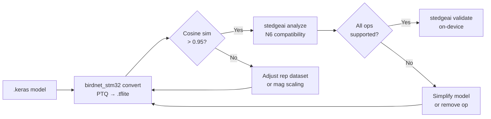

# Quantization

## Strategy

BirdNET-STM32 uses **post-training quantization (PTQ)** to convert trained
Keras models to INT8 TFLite for the STM32N6 NPU.

| Aspect | Choice | Rationale |
|---|---|---|
| Weight precision | INT8 | Required by N6 NPU |
| Activation precision | INT8 | Required by N6 NPU |
| I/O precision | Float32 | Audio inputs are continuous-valued; INT8 I/O destroys precision |
| Calibration | Representative dataset | 1024 samples from training data |

## QAT (quantization-aware training)

BirdNET-STM32 also supports **quantization-aware training (QAT)** as an
optional fine-tuning step (`--qat`). QAT injects INT8 quantization noise into
weights during training so the model learns to tolerate quantization error.

The implementation uses **shadow-weight fake-quantization**
(`birdnet_stm32/training/qat.py`):

1. Freeze BatchNorm layers (running statistics are kept).
2. Before each forward pass, fake-quantize Conv2D / DepthwiseConv2D / Dense
   kernel weights to INT8 range (per-channel).
3. Train with a low learning rate (typically 1e-4) for a few epochs.
4. Save the model with original float32 weights — no FakeQuant ops remain.

Because no FakeQuant nodes are saved, the resulting `.keras` model is fully
compatible with the STM32N6 NPU after standard PTQ conversion.

```bash
python -m birdnet_stm32 train --data_path_train data/train \
  --qat --checkpoint_path checkpoints/best_model.keras \
  --epochs 10 --learning_rate 0.0001
```

!!! tip "When to use QAT"
    Use QAT when PTQ cosine similarity is below 0.95 despite trying PWL
    magnitude scaling and adjusting the representative dataset. QAT typically
    recovers 1–3% accuracy lost during quantization.

## Representative dataset

The calibration dataset is critical for PTQ quality:

- **Source**: randomly sampled training files, center-cropped to chunk duration.
- **Size**: 1024 samples (default). More is not necessarily better.
- **Diversity**: moderate diversity is ideal. Overly diverse datasets widen
  INT8 quantization ranges, reducing precision.
- **Target**: cosine similarity > 0.95 between Keras and TFLite outputs.

## Cosine similarity troubleshooting

| Symptom | Likely cause | Fix |
|---|---|---|
| Cosine sim < 0.90 | `db` magnitude scaling | Switch to `pwl` |
| Cosine sim 0.90–0.95 | Too-diverse representative set | Reduce `--num_samples` or filter by SNR |
| Cosine sim varies across runs | Non-deterministic data order | Set `--deterministic` (when available) |
| stedgeai analyze fails | Unsupported op in model | Check operator, simplify model |

## Channel alignment

The N6 NPU vectorizes computation in groups of 8 channels. Misaligned channel
counts either:

- Waste compute cycles (padding to next multiple of 8)
- Fail compilation entirely

The model builder enforces alignment via `_make_divisible(channels, 8)`. When
adding new layers or architectures, always maintain this constraint.

## Validation workflow

After conversion, always follow this sequence:


