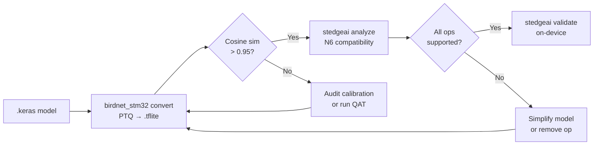

# Quantization

## Strategy

BirdNET-STM32 uses **post-training quantization (PTQ)** to convert trained
Keras models to INT8 TFLite for the STM32N6 NPU.

| Aspect | Choice | Rationale |
|---|---|---|
| Weight precision | INT8 | Required by N6 NPU |
| Activation precision | INT8 | Required by N6 NPU |
| I/O precision | Float32 | Audio inputs are continuous-valued; INT8 I/O destroys precision |
| Calibration | Representative dataset | 1024 samples from training data |

## QAT (quantization-aware training)

BirdNET-STM32 also supports **quantization-aware training (QAT)** as an
optional fine-tuning step (`--qat`). QAT injects the INT8 noise produced by
both kernel and activation requantization so the model learns the deployment
numerics rather than only the compressed weights.

The implementation is native Keras 3 (`birdnet_stm32/training/qat.py`):

1. Freeze BatchNorm layers (running statistics are kept).
2. Measure scalar activation ranges on the same exact, deterministic 1,024
   stratified training inputs used by final conversion.
3. Run Conv2D, DepthwiseConv2D, and Dense kernels through a differentiable,
   symmetric per-channel INT8 grid.
4. Requantize the model input, fused outer activation boundaries, and custom
   raw-frontend internals on asymmetric per-tensor INT8 grids.
5. Fine-tune at a low learning rate, while checkpointing the clean model that
   shares standard variables and receives synchronized frontend variables.
   Select QAT checkpoints by validation tail loss; record ROC-AUC and enforce
   the task-accuracy gate during paired float/INT8 evaluation.
6. Add Bernoulli KL plus mean and worst-sample per-sample cosine consistency
   against a frozen copy of the untouched float checkpoint. By default the
   tail term targets the worst 10% of each batch with 0.75 weight, preserving
   calibrated low-confidence outputs while directly protecting the p05 parity
   tail.

Because no FakeQuant nodes are saved, the resulting `.keras` model is fully
compatible with the STM32N6 NPU after standard PTQ conversion.

```bash
python -m birdnet_stm32 train --data_path_train data/train \
  --qat --checkpoint_path checkpoints/best_model.keras \
  --qat_calibration_samples 1024 \
  --qat_cosine_tail_fraction 0.10 --qat_cosine_tail_weight 0.75 \
  --epochs 10 --learning_rate 0.0001
```

!!! tip "When to use QAT"
    Use QAT when PTQ cosine similarity is below 0.95 despite trying PWL
    magnitude scaling and auditing the representative dataset. Always rerun
    held-out parity and task-level float/INT8 evaluation after QAT.

    Keep the untouched pre-QAT checkpoint. For a public QAT-derived release,
    use the canonical basename for the deployable checkpoint and preserve the
    source checkpoint with an `_original_FP32.keras` suffix.

## Representative dataset

The calibration dataset is critical for PTQ quality:

- **Source**: deterministic, class-stratified training files, center-cropped to chunk duration.
- **Size**: 1024 samples (default). More is not necessarily better.
- **Diversity**: include quiet, nuisance, and positive examples. Energy
  filtering silently changes the requested sample count and biases deployment
  calibration, so it is disabled by default.
- **Holdout**: validation paths are stratified and disjoint from calibration.
- **Provenance**: conversion reports include manifest counts, class coverage,
  and SHA-256 identities.
- **Target**: mean cosine similarity ≥ 0.95 and fifth percentile ≥ 0.90.

## Cosine similarity troubleshooting

| Symptom | Likely cause | Fix |
|---|---|---|
| Cosine sim < 0.90 | `db` magnitude scaling | Switch to `pwl` |
| Cosine sim 0.90–0.95 | Activation outliers or weak QAT coverage | Compare deterministic sample-count sweeps and inspect task-level deltas |
| Cosine sim varies across runs | Input manifest or preprocessing changed | Compare the recorded calibration and validation manifests |
| stedgeai analyze fails | Unsupported op in model | Check operator, simplify model |

## Channel alignment

The N6 NPU vectorizes computation in groups of 8 channels. Misaligned channel
counts either:

- Waste compute cycles (padding to next multiple of 8)
- Fail compilation entirely

The model builder enforces alignment via `_make_divisible(channels, 8)`. When
adding new layers or architectures, always maintain this constraint.

## Validation workflow

After conversion, always follow this sequence:


```mermaid
flowchart LR
    A[".keras model"] --> B["birdnet_stm32 convert\nPTQ → .tflite"]
    B --> C{"Cosine sim\n> 0.95?"}
    C -->|Yes| D["stedgeai analyze\nN6 compatibility"]
    C -->|No| E["Audit calibration\nor run QAT"]
    E --> B
    D --> F{"All ops\nsupported?"}
    F -->|Yes| G["stedgeai validate\non-device"]
    F -->|No| H["Simplify model\nor remove op"]
    H --> B
```

A conversion is staged to a temporary file and promoted atomically only after
the parity gates pass. A failed command produces a diagnostic report, not a
deployable `.tflite`.
