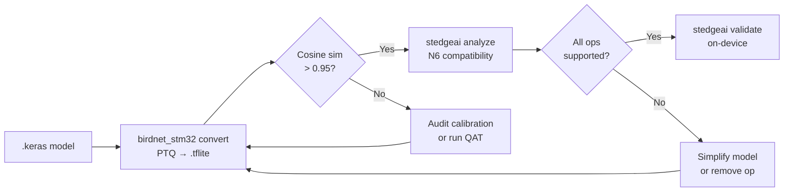

# Quantization

## Strategy

BirdNET-STM32 uses **post-training quantization (PTQ)** to convert trained
Keras models to INT8 TFLite for the STM32N6 NPU.

| Aspect | Choice | Rationale |
|---|---|---|
| Weight precision | INT8 | Required by N6 NPU |
| Activation precision | INT8 | Required by N6 NPU |
| I/O precision | Float32 | Public audio API contract; internal audio quantization still occurs |
| Calibration | Representative dataset | 1024 samples from training data |

## QAT (quantization-aware training)

QAT fine-tunes a float checkpoint with simulated INT8 kernels and activation
boundaries. **The selected model maximizes exact converted INT8 validation
cMAP.** Teacher losses and PR-AUC are diagnostics, not checkpoint criteria.

```bash
python -m birdnet_stm32 train --qat \
  --checkpoint_path checkpoints/model.keras \
  --data_path_train data/train --data_path_val data/validation \
  --qat_calibration_samples 1024 --epochs 8 --learning_rate 2e-5
```

An explicit disjoint validation directory is required. The evaluator uses
file-level max pooling and 50% overlap by default; `--validation_pooling` and
`--validation_overlap` define the policy. Catalog-test files are not used for
checkpoint selection. Each epoch costs a conversion and file evaluations in
addition to training.

### Selection and artifacts

Before training, score the untouched float teacher and the starting converted
model. After each epoch, synchronize frontend weights, convert with the same
cached calibration tensors, and measure exact class-macro average precision
using the same evaluator as the CLI. Keep epoch zero if fine-tuning does not
improve its INT8 score. A failed conversion or incomplete validation manifest
fails the run rather than substituting a proxy metric.

The run saves a matching pair, `<checkpoint>_qat.keras` and
`<checkpoint>_qat_INT8.tflite`, with config, labels and a `_qat_selection.json`
report. The report records the selected epoch, both hashes, original float
cMAP, post-QAT float cMAP, actual INT8 cMAP, calibration identity and evaluation
policy. The reported total drop always uses the untouched float reference.
Use the selected TFLite bytes when comparing runs; reconversion is a new
artifact that must be evaluated again. Existing QAT outputs are never overwritten
by another run; use a new experiment directory.

These artifacts are for development. Publication still requires configured
parity checks, advertised runtimes, ONNX validation when included, STM32N6
compilation and board validation. QAT does not itself establish those checks.

### Simulation

BatchNorm statistics and affine parameters are frozen in both the clean and
cloned QAT frontends. Kernels use symmetric per-channel fake quantization;
activations use per-tensor grids. The sigmoid head simulates both the logit
boundary and TFLite's fixed 1/256 probability grid.

Every tensor the converter quantizes is a boundary in the simulation,
including each partial filterbank convolution output inside the raw frontend.
Activation ranges are absolute min/max, as the converter measures them, and
are recalibrated on the current weights after every epoch
(`--qat_range_refresh`, on by default). With both, simulated and converted
validation cMAP agree to within a few thousandths; both are logged
(`val_sim_int8_cmap`, `val_int8_cmap`). Percentile-clipped ranges were removed
in 1.3.0 after p99.9 and p99.99 both scored below the full range.

Converter fusion and rounding can still differ, so real INT8 evaluation remains
the selection authority.

The PWL frontend is a learned hinge sum, not a guaranteed log approximation.
Its original positive hinge coefficients initialize increasing slopes; training
does not constrain it to be monotone or concave. A constrained compressive
variant was measured and removed (best float, worst INT8).

### Losses

Supervised BCE is combined with Bernoulli KL and optional mean/tail cosine
losses against the frozen teacher. Existing weights remain explicit controls
for controlled comparisons. Their numerical values and scalar contribution do
not establish that they improve per-class ranking. Change one at a time and
judge the resulting converted INT8 cMAP.

## Representative dataset

The calibration dataset is critical for PTQ quality:

- **Source**: deterministic, class-stratified training files, center-cropped to chunk duration.
- **Size**: 1024 samples (default). More is not necessarily better.
- **Diversity**: include quiet, nuisance, and positive examples. Energy
  filtering silently changes the requested sample count and biases deployment
  calibration, so it is disabled by default.
- **Holdout**: validation paths are stratified and disjoint from calibration.
- **Provenance**: conversion reports include manifest counts, class coverage,
  and SHA-256 identities.
- **Target**: mean cosine similarity ≥ 0.95 and fifth percentile ≥ 0.90.

## Cosine similarity troubleshooting

| Symptom | Likely cause | Fix |
|---|---|---|
| Cosine sim < 0.90 | `db` magnitude scaling | Switch to `pwl` |
| Cosine sim 0.90–0.95 | Activation outliers or weak QAT coverage | Compare deterministic sample-count sweeps and inspect task-level deltas |
| Cosine sim varies across runs | Input manifest or preprocessing changed | Compare the recorded calibration and validation manifests |
| stedgeai analyze fails | Unsupported op in model | Check operator, simplify model |

## Channel alignment

The N6 NPU vectorizes computation in groups of 8 channels. Misaligned channel
counts either:

- Waste compute cycles (padding to next multiple of 8)
- Fail compilation entirely

The model builder enforces alignment via `_make_divisible(channels, 8)`. When
adding new layers or architectures, always maintain this constraint.

## Validation workflow

After conversion, always follow this sequence:


```mermaid
flowchart LR
    A[".keras model"] --> B["birdnet_stm32 convert\nPTQ → .tflite"]
    B --> C{"Cosine sim\n> 0.95?"}
    C -->|Yes| D["stedgeai analyze\nN6 compatibility"]
    C -->|No| E["Audit calibration\nor run QAT"]
    E --> B
    D --> F{"All ops\nsupported?"}
    F -->|Yes| G["stedgeai validate\non-device"]
    F -->|No| H["Simplify model\nor remove op"]
    H --> B
```

A conversion is staged to a temporary file and promoted atomically only after
the parity gates pass. A failed command produces a diagnostic report, not a
deployable `.tflite`.
