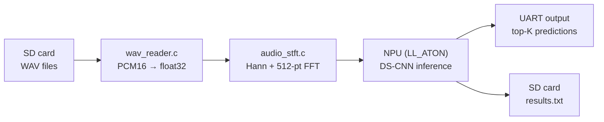

# Firmware Overview

The BirdNET-STM32 firmware is a **standalone bare-metal application** for the
[STM32N6570-DK](https://www.st.com/en/evaluation-tools/stm32n6570-dk.html)
development board. It reads WAV files from an SD card, computes a Short-Time
Fourier Transform (STFT) on the Cortex-M55 CPU, runs neural-network inference
on the dedicated NPU, and reports bird species detections over UART and back to
the SD card.

!!! info "Design principle"
    The firmware is a self-contained integration test **and** demo. Everything
    runs on the board — no host preprocessing, no streaming, no RTOS. This
    makes it easy to validate the full pipeline (audio → spectrogram → NPU →
    classification) in isolation.

## At a Glance

| Property | Value |
|---|---|
| Language | C11 (ARM GCC 13+) |
| RTOS | None (bare-metal, single-threaded `while(1)` loop) |
| Board | STM32N6570-DK |
| CPU | Arm Cortex-M55 @ 800 MHz |
| NPU | ST Neural-ART, 1.2 TOPS INT8 |
| Build system | Overlay on ST's NPU_Validation Makefile |
| Flash method | GDB via `n6_loader.py` (part of X-CUBE-AI) |

## Processing Pipeline



For each `.wav` file on the SD card:

1. **Read** — parse RIFF/WAVE header, load the first 3-second chunk as float32.
2. **STFT** — 512-point Hann-windowed FFT, 256 time frames → `[257, 256]`
   magnitude spectrogram.
3. **NPU inference** — copy spectrogram to NPU input, run the full DS-CNN
   (including the learned mel filter and PWL compression), read class scores.
4. **Output** — print top-K species over UART; optionally write TSV results to
   the SD card.

## Typical Performance

| Stage | Time | Notes |
|---|---|---|
| SD read | 10–20 ms | 3 s @ 24 kHz = 144 KB of PCM16 |
| STFT | 25–35 ms | 256 × 512-pt FFT on Cortex-M55 @ 800 MHz |
| NPU inference | 3–5 ms | INT8 DS-CNN including mel + PWL layers |
| **Total** | **~40–60 ms** | **50–75× faster than real-time** for a 3 s chunk |

## Source Layout

```
firmware/
├── Src/
│   ├── main.c           # Board init + processing loop
│   ├── wav_reader.c     # RIFF/WAVE parser, PCM16→float32
│   ├── audio_stft.c     # Hann-windowed STFT
│   ├── fft.c            # 512-pt real FFT (radix-2 DIT)
│   └── sd_handler.c     # BSP SD + FatFs mount/scan/write
├── Inc/
│   ├── app_config.h     # Audio params (patched at deploy time)
│   ├── app_labels.h     # Class names (auto-generated)
│   ├── wav_reader.h
│   ├── audio_stft.h
│   ├── fft.h
│   └── sd_handler.h
├── Drivers/
│   ├── HAL_SD/          # HAL SD card driver sources
│   ├── FatFs/           # FatFs R0.15 filesystem
│   └── stm32n6570_discovery_sd.*  # BSP SD driver
└── README.md            # Standalone firmware reference
```

## Next Steps

<div class="grid cards" markdown>

-   :material-chip:{ .lg .middle } **[Hardware](hardware.md)**

    Learn about the STM32N6570-DK board, Cortex-M55, NPU, memory map.

-   :material-wrench:{ .lg .middle } **[Building & Flashing](building.md)**

    How to build the firmware and flash it to the board.

-   :material-cog:{ .lg .middle } **[Configuration](configuration.md)**

    Adapt the firmware to your model and audio parameters.

-   :material-code-braces:{ .lg .middle } **[Source Modules](modules.md)**

    Detailed reference for every C source file.

-   :material-serial-port:{ .lg .middle } **[UART Protocol](protocol.md)**

    Serial output format and host-side parsing.

-   :material-bug:{ .lg .middle } **[Troubleshooting](troubleshooting.md)**

    Common pitfalls, debugging hints, and known issues.

</div>
