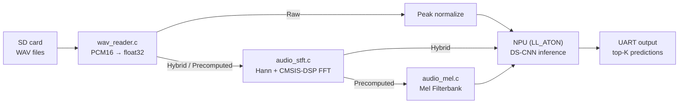

# Firmware Overview

The BirdNET-STM32 firmware is a **standalone bare-metal application** for the
[STM32N6570-DK](https://www.st.com/en/evaluation-tools/stm32n6570-dk.html)
development board. It reads WAV files from an SD card, applies the selected
frontend on-board, runs neural-network inference on the dedicated NPU, and
reports bird species detections over UART.

!!! info "Design principle"
    The firmware is a self-contained integration test **and** demo. Everything
    runs on the board — no host preprocessing, no streaming, no RTOS. This
    makes it easy to validate the full pipeline (audio → spectrogram → NPU →
    classification) in isolation.

## At a Glance

| Property | Value |
|---|---|
| Language | C11 (ARM GCC 13+) |
| RTOS | None (bare-metal, single-threaded `while(1)` loop) |
| Board | STM32N6570-DK |
| CPU | Arm Cortex-M55 with Helium @ 400 MHz by default (800 MHz overdrive) |
| NPU | ST Neural-ART @ 400 MHz by default (1 GHz overdrive) |
| Build system | Overlay on ST's NPU_Validation Makefile |
| Flash method | GDB via `n6_loader.py` (part of X-CUBE-AI) |

## Processing Pipeline


```mermaid
flowchart LR
    SD["SD card<br/>WAV files"] --> WAV["wav_reader.c<br/>PCM16 → float32"]
    WAV --> |Hybrid / Precomputed| STFT["audio_stft.c<br/>Hann + CMSIS-DSP FFT"]
    WAV --> |Raw| NORM["Peak normalize"] --> NPU
    STFT --> |Precomputed| Mel["audio_mel.c<br/>Mel Filterbank"]
    STFT --> |Hybrid| NPU["NPU (LL_ATON)<br/>DS-CNN inference"]
    Mel --> NPU
    NPU --> UART["UART output<br/>top-K predictions"]
```

For each `.wav` file on the SD card:

1. **Read** — parse RIFF/WAVE header, load the first chunk (2-3 seconds) as float32.
2. **Audio Frontend** — depends on `APP_AUDIO_FRONTEND`:
   - **Hybrid**: 512-point STFT with centred frames and a periodic Hann window, as `librosa.stft` → `[256, frames]` magnitude spectrogram (Nyquist omitted), min-max normalized to [0, 1] like the host.
   - **Precomputed**: STFT followed by an explicitly mapped Mel filterbank → `[64, frames]`.
   - **Raw**: Peak-normalize the PCM waveform, then pass it to the in-model Gabor frontend.
3. **NPU inference** — copy features to NPU input, run the full DS-CNN (handling mel/PWL mappings intrinsically if required), read class scores.
4. **Output** — print top-K species and timing over UART for host-side parsing.

## Typical Performance

Measured with the 1.5 models at the default 400 MHz clock profile, 24 kHz, one
2.5 s chunk per file:

| Stage | Hybrid (256 × 384 input) | Raw | Notes |
|---|---|---|---|
| SD read | 59 ms | 59 ms | Depends on the card; a recorder streaming from its microphone does not pay it |
| STFT | 33 ms | **0 ms** | CMSIS-DSP Helium FFT; raw computes its filterbank on the NPU |
| NPU inference | 19 ms | 15 ms | Model-dependent |
| **Total** | **113 ms** | **75 ms** | Both far faster than real time |

## Source Layout

```
firmware/
├── Src/
│   ├── main.c           # Board init + processing loop
│   ├── wav_reader.c     # RIFF/WAVE parser, PCM16→float32
│   ├── audio_stft.c     # Hann-windowed STFT (CMSIS-DSP FFT)
│   ├── audio_mel.c      # Mel filterbank (precomputed frontend)
│   └── sd_handler.c     # BSP SD + FatFs mount/scan/write
├── Inc/
│   ├── app_config.h     # Audio params (patched at deploy time)
│   ├── app_labels.h     # Class names (auto-generated)
│   ├── wav_reader.h
│   ├── audio_stft.h
│   ├── audio_mel.h
│   └── sd_handler.h
├── Drivers/
│   ├── CMSIS-DSP/       # Vendored CMSIS-DSP subset: real FFT + magnitude (Helium)
│   ├── HAL_SD/          # HAL SD card driver sources
│   ├── FatFs/           # FatFs R0.15 filesystem
│   └── stm32n6570_discovery_sd.*  # BSP SD driver
└── README.md            # Standalone firmware reference
```

## Next Steps

<div class="grid cards" markdown>

-   :material-chip:{ .lg .middle } **[Hardware](hardware.md)**

    Learn about the STM32N6570-DK board, Cortex-M55, NPU, memory map.

-   :material-wrench:{ .lg .middle } **[Building & Flashing](building.md)**

    How to build the firmware and flash it to the board.

-   :material-cog:{ .lg .middle } **[Configuration](configuration.md)**

    Adapt the firmware to your model and audio parameters.

-   :material-code-braces:{ .lg .middle } **[Source Modules](modules.md)**

    Detailed reference for every C source file.

-   :material-serial-port:{ .lg .middle } **[UART Protocol](protocol.md)**

    Serial output format and host-side parsing.

-   :material-bug:{ .lg .middle } **[Troubleshooting](troubleshooting.md)**

    Common pitfalls, debugging hints, and known issues.

</div>
