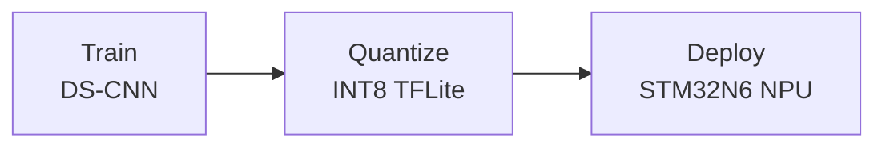

# BirdNET-STM32

Bird sound classification for edge deployment on the
[STM32N6570-DK](https://www.st.com/en/evaluation-tools/stm32n6570-dk.html)
development board with neural processing unit (NPU).

## Overview

BirdNET-STM32 trains a compact depthwise-separable CNN (DS-CNN) on mel
spectrograms, quantizes it to INT8 via post-training quantization, and deploys
the resulting TFLite model to the STM32N6570-DK using ST's X-CUBE-AI toolchain.



Depending on the chosen audio frontend, a single inference on a 2-3 second 
audio chunk takes approximately **10-14 ms** end-to-end on the board:
- **Hybrid (STFT on CPU):** ~45ms STFT + ~12ms NPU
- **Raw (Waveform to NPU):** 0ms STFT + ~10ms NPU

## Quick start

```bash
# Clone and install
git clone https://github.com/birdnet-team/birdnet-stm32.git
cd birdnet-stm32
python3.12 -m venv .venv && source .venv/bin/activate
pip install -e ".[dev]"

# Train
python train.py --data_path_train data/train --audio_frontend hybrid --mag_scale pwl

# Convert to quantized TFLite
python convert.py --checkpoint_path checkpoints/best_model.keras \
  --model_config checkpoints/best_model_model_config.json --data_path_train data/train

# Evaluate
python test.py --model_path checkpoints/best_model_quantized.tflite \
  --model_config checkpoints/best_model_model_config.json --data_path_test data/test
```

See the [Getting Started](getting-started.md) guide for full setup instructions
and the [Deployment](deployment.md) guide for flashing the STM32N6570-DK.

## Key features

- **Three audio frontends**: precomputed mel, hybrid (STFT + learned mel
  mixer), and raw waveform — all quantization-friendly.
- **Scalable DS-CNN**: width (`alpha`) and depth (`depth_multiplier`) knobs for
  accuracy/size trade-offs.
- **Post-training quantization**: float32 I/O with INT8 internals, targeting
  >0.95 cosine similarity vs. the float model.
- **End-to-end deployment**: `stedgeai generate` → serial flash → on-device
  validation, all from the CLI.

## Project layout

```
train.py            # Training entry point
convert.py          # Keras → quantized TFLite
test.py             # Evaluation entry point
birdnet_stm32/      # Python package (models, audio, data, deploy, ...)
docs/               # This documentation
```
