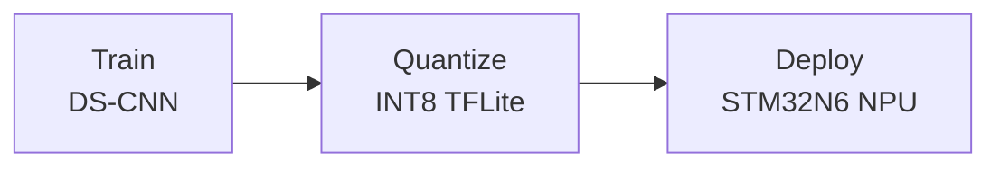

# BirdNET-STM32

Bird sound classification for edge deployment on the
[STM32N6570-DK](https://www.st.com/en/evaluation-tools/stm32n6570-dk.html)
development board with neural processing unit (NPU).

## Overview

BirdNET-STM32 trains a compact depthwise-separable CNN (DS-CNN) on mel
spectrograms, quantizes it to INT8 via post-training quantization, and deploys
the resulting TFLite model to the STM32N6570-DK using ST's X-CUBE-AI toolchain.



Depending on the chosen audio frontend, a single inference on a 2-3 second 
audio chunk takes approximately **10-14 ms** end-to-end on the board:
- **Hybrid (STFT on CPU):** ~45ms STFT + ~12ms NPU
- **Raw (Waveform to NPU):** 0ms STFT + ~10ms NPU

## Quick start

```bash
# Clone and install
git clone https://github.com/birdnet-team/birdnet-stm32.git
cd birdnet-stm32
python3.12 -m venv .venv && source .venv/bin/activate
pip install -e ".[dev]"

# Train
python -m birdnet_stm32 train --data_path_train data/train \
  --audio_frontend hybrid --mag_scale pwl

# Convert to quantized TFLite
python -m birdnet_stm32 convert \
  --checkpoint_path checkpoints/best_model.keras \
  --model_config checkpoints/best_model_model_config.json \
  --data_path_train data/train

# Evaluate
python -m birdnet_stm32 evaluate \
  --model_path checkpoints/best_model_quantized.tflite \
  --model_config checkpoints/best_model_model_config.json \
  --data_path_test data/test
```

See the [Getting Started](getting-started.md) guide for full setup instructions
and the [Deployment](deployment.md) guide for flashing the STM32N6570-DK.

## Key features

- **Five audio frontends**: `librosa` (precomputed mel), `hybrid` (STFT +
  learned mel mixer), `raw` (waveform → learned filterbank), `mfcc`
  (precomputed MFCC), and `log_mel` (precomputed log-mel) — all
  quantization-friendly. `hybrid` and `raw` are the deployment options.
- **Scalable DS-CNN**: width (`alpha`) and depth (`depth_multiplier`) knobs,
  optional SE attention (`--use_se`), inverted residual blocks
  (`--use_inverted_residual`), and attention pooling
  (`--use_attention_pooling`).
- **Post-training quantization**: float32 I/O with INT8 internals, targeting
  >0.95 cosine similarity vs. the float model. Per-channel (default) or
  per-tensor, plus dynamic range mode.
- **Quantization-aware training (QAT)**: shadow-weight fake-quantization
  fine-tuning via `--qat` for improved INT8 accuracy. No FakeQuant ops in the
  saved model — N6 compatible.
- **Optuna hyperparameter search**: `--tune --n_trials 20` for automated
  architecture and training hyperparameter optimization.
- **Comprehensive evaluation**: ROC-AUC, cmAP, F1, species-level AP with
  bootstrap CI, DET curves, latency measurement, benchmark mode, and HTML
  reports.
- **End-to-end deployment**: `stedgeai generate` → serial flash → on-device
  validation, all from the CLI.

## Project layout

```
birdnet_stm32/      # Python package (models, audio, data, deploy, ...)
  cli/              # CLI subcommands (train, convert, evaluate, deploy, board-test)
  models/           # DS-CNN, frontend, magnitude scaling, profiler
  audio/            # Audio I/O, spectrogram, augmentation
  training/         # Trainer, QAT, Optuna tuner, LR finder
  conversion/       # PTQ, validation, ONNX export
  evaluation/       # Metrics, pooling, reporting
  deploy/           # stedgeai wrappers, N6 loader
firmware/           # Standalone C firmware for STM32N6570-DK
docs/               # This documentation
```

All commands use the unified CLI entry point:

```bash
python -m birdnet_stm32 {train,convert,evaluate,deploy,board-test}
```
