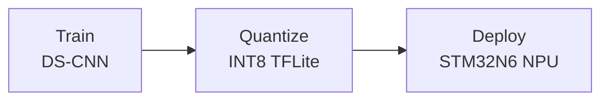

# BirdNET-STM32

Bird sound classification for edge deployment on the
[STM32N6570-DK](https://www.st.com/en/evaluation-tools/stm32n6570-dk.html)
development board with neural processing unit (NPU).

## Overview

BirdNET-STM32 trains a compact depthwise-separable CNN (DS-CNN) on raw
waveforms or spectral features, quantizes it to INT8 via post-training
quantization, and deploys the resulting TFLite model to the STM32N6570-DK
using ST's X-CUBE-AI toolchain.


```mermaid
flowchart LR
    A["Train\nDS-CNN"] --> B["Quantize\nINT8 TFLite"] --> C["Deploy\nSTM32N6 NPU"]
```

Performance depends on the frontend, model, and SD card. The v1.0 USNE model's
verified 24 kHz, 2.5-second raw configuration averages **6 ms NPU time** and
**78 ms total** including SD-card reads—about 32× faster than real time.

## Quick start

```bash
# Clone and install
git clone https://github.com/birdnet-team/birdnet-stm32.git
cd birdnet-stm32
python3.12 -m venv .venv && source .venv/bin/activate
pip install -e ".[dev]"

# Train
python -m birdnet_stm32 train --data_path_train data/train \
  --audio_frontend hybrid --mag_scale pwl

# Convert to quantized TFLite
python -m birdnet_stm32 convert \
  --checkpoint_path checkpoints/best_model.keras \
  --model_config checkpoints/best_model_model_config.json \
  --data_path_train data/train

# Evaluate
python -m birdnet_stm32 evaluate \
  --model_path checkpoints/best_model_quantized.tflite \
  --model_config checkpoints/best_model_model_config.json \
  --data_path_test data/test
```

See the [Getting Started](getting-started.md) guide for full setup instructions
and the [Deployment](deployment.md) guide for flashing the STM32N6570-DK.

Pre-trained release assets use one basename across formats. Version 1.0's
30-species northeastern-US bundle is `BirdNET_Tiny_N6_USNE_30_V1.0`; its eight
nuisance outputs are excluded from the species count but remain part of the
ordered output contract. Its frozen-catalog INT8 results are ROC-AUC 0.963227
and class-macro AP 0.669244. Precision-bearing filenames append `_FP32`,
`_FP16`, or `_INT8` to the family basename.

## Key features

- **Five audio frontends**: `librosa` (precomputed mel), `hybrid` (linear STFT +
  learned mel mixer), `raw` (waveform → learned filterbank), `mfcc`
  (precomputed MFCC), and `log_mel` (precomputed log-mel) — all
  quantization-friendly. The firmware supports `raw`, `hybrid`, and `librosa`;
  `mfcc` and `log_mel` remain host-preprocessed paths.
- **Scalable DS-CNN**: width (`alpha`) and depth (`depth_multiplier`) knobs,
  SE attention and inverted residual blocks by default (disable with
  `--no_se` / `--no_inverted_residual`), plus optional attention pooling
  (`--use_attention_pooling`).
- **Post-training quantization**: float32 I/O with INT8 internals, targeting
  >0.95 cosine similarity vs. the float model. Per-channel (default) or
  per-tensor, plus dynamic range mode.
- **Quantization-aware training (QAT)**: per-channel kernel and per-tensor
  activation INT8 simulation via `--qat`, aligned to final conversion's exact
  calibration manifest. Frozen-teacher KL plus mean and worst-sample cosine
  consistency protect mean and tail parity. The saved deployment checkpoint
  has no FakeQuant ops and remains N6 compatible.
- **Optuna hyperparameter search**: `--tune --n_trials 20` for automated
  architecture and training hyperparameter optimization.
- **Comprehensive evaluation**: ROC-AUC, cmAP, F1, species-level AP with
  bootstrap CI, DET curves, latency measurement, benchmark mode, and HTML
  reports.
- **End-to-end deployment**: `stedgeai generate` → serial flash → on-device
  validation, all from the CLI.

## Project layout

```
birdnet_stm32/      # Python package (models, audio, data, deploy, ...)
  cli/              # CLI subcommands (train, convert, evaluate, deploy, board-test)
  models/           # DS-CNN, frontend, magnitude scaling, profiler
  audio/            # Audio I/O, spectrogram, augmentation
  training/         # Trainer, QAT, Optuna tuner, linear probing
  conversion/       # PTQ, validation, ONNX export
  evaluation/       # Metrics, pooling, reporting
  deploy/           # stedgeai wrappers, N6 loader
firmware/           # Standalone C firmware for STM32N6570-DK
docs/               # This documentation
```

All commands use the unified CLI entry point:

```bash
python -m birdnet_stm32 {train,convert,evaluate,deploy,board-test}
```
